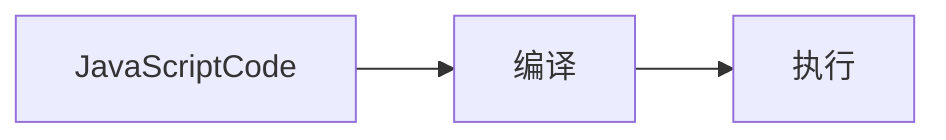

> 1.  JavaScript 代码是按顺序执行吗？先编译、后执行。编译出执行上下文与可执行代码。
> 2.  为什么 JavaScript 代码会出现栈溢出
> 3.  var 与 let 和 const，var 缺陷是什么
> 4.  作用域链与闭包


## 1. 变量提升
```Javascript
console.log(name)
fn();
fn_var();

var name; // 声明
name = 123; // 赋值部分

function fn() {
  console.log('完整的函数声明')
}

var fn_var = function() {
  console.log('匿名函数赋值给变量')
}

// VM791:1
// VM791:8 完整的函数声明
/**
VM791:3 Uncaught TypeError: fn_var is not a function
    at <anonymous>:3:1
(anonymous) @ VM791:3 */
```
<!--more-->

name 和 函数 fn 正确打印出结果，Javascript 代码执行过程中，Javascript 引擎把变量声明部分和函数声明部分提升到代码开头的行为，叫做 **变量提升**。
变量提升后，会给变量设置默认值 undefined。

`Uncaught TypeError: fn_var is not a function` 因为 fn_var 是变量，提升后相当于 `fn_var = undefined`，所以报错，fn_var 不是一个函数。

### JavaScript 代码的执行流程


### 1-1-demo 分析以下代码
```JavaScript
var name = "variable promotion";
function showName(){ console.log(name); if(0){ var name = "variable promotion case" } console.log(name);}
showName()

// undefined
// undefined
```

[javascript Code] as js
note left of js: var name = "variable promotion"; \n function showName(){...} \n showName();
package "call stack" as callStack {
  rectangle "execution context of global" {
    rectangle "变量环境"
    note right of "变量环境":name=undefined;\n function showName(){...}
    rectangle "词法环境"
  }
  cloud {
    rectangle "可执行代码"
      note right of "可执行代码":showName();
  }
}
js --> callStack: 编译（compile）


`全局执行上下文压入栈以后，JavaScript 引擎开始执行全局代码。先给 name 变量赋值，再调用函数showName`**调用函数时，javascript 引擎编译该函数，为其创建执行上下文，再将执行上下文压入栈** 结果如下：

[javascript Code] as js
note left of js: var name = "variable promotion"; \n function showName(){...} \n showName();
package "call stack" as callStack {
  rectangle "execution context of global" {
    rectangle "变量环境"
    note right of "变量环境":name="variable promotion";\n showName();
    rectangle "词法环境"
  }
  rectangle "execution context of function showName" {
    rectangle "showName变量环境"
    note right of "showName变量环境": name=undefined
    rectangle "showName词法环境"
  }
}
js --> callStack: 编译（compile）

`函数执行上下文压入栈后，JavaScript 引擎再执行showName函数代码。`最终打印出结果 undefined

### 1-2-demo.  分析以下代码
```javascript
showName();
var showName = function() {
  console.log(1)
}
```
> VM4235:1 Uncaught TypeError: showName is not a function
* 编译阶段：全局执行上下文环境变量 `showName = undefined` 写入内存，可执行代码 `showName()`
* 执行阶段：代码按顺序执行，先执行第一行 `showName()`，环境变量中存在 showName，值是 undefined，并不是一个函数。所以报错 `showName is not a function`

```javascript
showName();
var showName = function() {
  console.log(1)
}
function showName() {
  console.log(2)
}
```
> 打印出 2
* 编译阶段：第一行 `showName()` 放入可执行代码；第二行声明变量 showName 放入全局执行上下文 `showName = undefined`；第 五 行 `覆盖 showName 赋值 function 引用`
* 执行阶段变量环境中找到 `函数 showName`，打印结果 2，showName 再次赋值 `function() {
  console.log(1)
}`的引用。下次再执行 showName() 打印结果是 1

### 变量提升带来的问题 —— 变量未能及时销毁
```JavaScript
function variableDestruction() {
  for (var i=0; i<5; i++){}
  console.log(i);
}
variableDestruction();
```
JavaScript 编译以上代码，生成全局上下文(环境变量 function variableDestruction(){...})，然后压入栈内存中。JavaScript 执行可执行代码 `variableDestruction()`，创建函数执行上下文(环境变量 i=undefined)，再将函数执行上下文 压入栈内存。javascript 引擎继续执行可执行代码 i 赋值、遍历、打印结果是 6。**因为没有块级作用域，导致遍历结果后没有销毁变量i,所以打印结果是 6**

## 2. 执行上下文与调用栈
代码执行之前进行编译创建执行上下文的三种情况：
1.  当 JavaScript 执行全局代码的时候，会编译全局代码并创建 **全局执行上下文**。整个页面的生命周期内，全局执行上下文只有一份；
2.  当调用一个函数时，函数体内的代码会被编译，并创建 **函数执行上下文**，一般情况下，函数执行结束后，创建的函数执行上下文被销毁；
3.  当使用 eval 函数的时候，eval 代码也会被编译，并创建执行上下文。

**`调用栈用来管理函数调用关系的一种数据结构。`**

### 2-1-demo. 分析代码
```JavaScript
var name = 'helen zhang';
function showName() {
  console.log(name)
}
showName();
```
1.  JavaScript 引擎编译代码时创建 **全局执行上下文**，执行第一行代码时声明变量name，并赋初值 undefined，执行第二行代码时，声明 function showName，将变量 name 和 函数 showName 放入变量环境。showName() 放入执行代码
2.  执行代码 showName()，创建 **函数执行上下文**。console.log(name) 放入执行代码。

以上创建的两个执行上下文是通过 **栈数据结构** 来管理的。

### JavaScript 调用栈
栈容器、入栈、出栈、栈中元素后进先出。
JavaScript 引擎创建执行上下文，然后压入 **调用栈**

<style>
arrow {
    LineColor transparent
}
</style>
stack callStack {
  rectangle "函数执行上下文" {
    rectangle "函数变量环境"
    rectangle "函数词法环境"
  }
  rectangle "全局执行上下文" {
    rectangle "全局变量环境"
    rectangle "全局词法环境"
  }
  函数执行上下文 .. 全局执行上下文

}


调用栈是 JavaScript 引擎追踪函数执行的一个机制。多个函数被调用时，通过调用栈可以追踪到哪个函数正在被执行以及各个函数之间的调用关系

#### chrome 开发者工具查看调用栈
1. javascript 代码打断点（debugger）
2. 执行时进入断点
3. 开发者工具右侧 call stack 查看调用栈


anonymous 全局函数入口
runStack 当前调用函数


#### console.trace() 输出函数调用关系


### 栈溢出（stack overflow)
`调用栈有大小的`，超出后 JavaScript 引擎会报错——超出最大栈调用大小（Maximum call stack size exceeded），栈溢出
递归没有任何终止条件的函数，会一直创建执行上下文，并反复压入栈中，栈容量有限，超过最大数量后会出现 Maximum call stack size exceeded

递归调用的形式改造成其他形式，或者使用加入定时器的方法来把当前任务拆分为其他很多小任务来解决栈溢出
```JavaScript
function runStack (n) {
  if (n === 0) return 100;
  return setTimeout(function(){
    runStack( n- 2)
  },0);
}
runStack(50000)
```

## 认识JavaScript块级作用域，通过块级作用域解决变量提升的问题
**作用域** 程序中定义变量的区域，该位置决定了变量的生命周期。通俗的理解，作用域是变量与函数的可访问范围，即作用域控制着变量和函数的可见性和生命周期。
ES6 之前两种作用域：
1.  **全局作用域** 中的对象在代码中任何地方都能访问，其生命周期为整个页面的生命周期；
2.  **函数作用域** 函数内部定义的变量或者函数，定义的变量和函数只能在函数内部访问。其生命周期从函数调用到函数执行结束。函数执行结束，函数内部定义的变量销毁。

ES6 之后引入了 let/const 声明关键字，使得 JavaScript 也能像其它语言一样拥有块级作用域了。 **块级作用域**，即使用一对大括号包裹的代码，如：函数、判断语句、循环语句等

`用块级作用域解决变量提升的问题`
```javascript
function variableDestruction() {
  for (let i=0;i<5;i++){}
  console.log(i)
}
variableDestruction();
```
> Uncaught ReferenceError: i is not defined 说明块级作用域生效，i 在 块级作用域以外不能访问。也就是在函数作用域内没有变量提升。

### ES6 怎么兼容变量提升和块级作用域的
从上下文的角度分析：
```JavaScript
function foo(){
  var a = 1;
  let b = 2;
  {
    let b = 3, d = 5;
    var c = 4;
    console.log(a)
    console.log(b)
  }
  console.log(b)
  console.log(c)
  console.log(d)
}
foo()
```
1.  编译并创建执行上下文

rectangle fnContext as "foo 函数执行上下文" {
  rectangle variableEnvironment as "变量环境" {
    card "a=undefined \n c=undefined"
  }

  rectangle lexicalEnvironment as "词法环境" {
    card "b=undefined"
  }
}

解析上图
* 函数内部 var 声明的变量，编译时存入 **变量环境**
* let 声明的变量，编译时存入 **记法环境（Lexical Environment）**
* 函数内部的块级作用域内部，通过 let 声明的变量编译阶段未放到词法环境中

2.  执行代码

rectangle fnContext as "foo 函数执行上下文" {
  rectangle variableEnvironment as "变量环境" {
    card "a=1 \n c=undefined"
  }

  rectangle lexicalEnvironment as "词法环境" {
    card "b=2"
    card "b=undefined \n d=undefined"
  }
}


3. 创建完词法块级作用域后，继续执行可执行代码 `console.log(a)`，具体是延着词法环境栈向下查找，有就返回给 JavaScript 引擎，如果词法环境中没有继续在变量环境中找。结果打印 1；`console.log(b)` 打印词法环境中的 `b=3`;块级词法环境出栈。`console.log(b)`, 打印块级词法环境 `b=2`;`console.log(c)`打印变量环境中`c=4`;`console.log(d)` 打印 undefined。因为吧，定义 d 的作用域已经出栈了。

### Uncaught ReferenceError: Cannot access 'myname' before initialization
```javascript
let myname= 'helen';
{
  console.log(myname);
  let myname= 'zhang';
}
```
**`分析：`** 块级作用域中，myname 声明提升到了 console.log(myname) 之前，但赋初值 undefined 未初提升。所以 `can not access myname before initialization`。**所以 let 声明的变量，声明会被提升，但赋初值不被提升。var 声明的变量，赋默认值都会被提升。function 声明、赋值都会被提升。**

## 作用域链
outer 用于指向外部的执行上下文的变量。每个执行上下文变量环境中，都包含这样一个引用。
```javascript
var name = 'helen';
function foo() {
  var name = 'zhang';
  bar();
}
function bar() {
  console.log(name)
}
```

rectangle callStack {
  rectangle globalContext as "全局上下文环境" {
    card globalEnvironment as "变量环境\nname='helen'" {
      rectangle "outer = null" as globalOuter
    }
    card "词法环境"
  }
  rectangle fooContext as "foo 函数执行上下文" {
    card "变量环境\nname='zhang'" {
      rectangle "outer" as fooOuter
      fooOuter --> globalEnvironment
    }
    card "foo词法环境"
  }
  rectangle barContext as "bar 函数执行上下文" {
    card "变量环境" {
      rectangle "outer" as barOuter
      barOuter --> globalEnvironment
    }
    card "bar词法环境"
  }
}

> 函数调用时，使用了外部变量，通过 function 关键字声明的函数，会延着执行上下文环境向上查找变量，这个路径就是叫做作用域链
JavaScript 执行过程中，其作用域链是由词法作用域决定的。

## 词法作用域
Javascript 执行过程中其作用域链是由词法作用域决定的。
**词法作用域** 是指作用域是由代码中函数声明的位置来决定的，所以词法作用域是静态的作用域，通过它就能预测代码在执行过程中如何查找标识。
词法作用域是代码编译阶段就决定好的，和函数是怎么调用没有关系

## 块级作用域的变量查找
```javascript
function bar() {
  var myName = "极客世界"
  let test1 = 100
  if (1) {
    let myName = "Chrome浏览器"
    console.log(test)
  }
}
function foo() {
  var myName = "极客邦"
  let test = 2
  {
    let test = 3
    bar()
  }
}
var myName = "极客时间"
let myAge = 10
let test = 1
foo() // 1
```

rectangle callStack {
  rectangle 全局执行上下文环境 as globalContext {
    card "变量环境\nfunction bar\nfunction foo\nmyName='极客时间'" as globalVariableEnvironment {
      rectangle outer
    }
    card "词法环境\nmyAge=10;\ntest=1" as globalLexicalEnvironment
    globalLexicalEnvironment -> globalVariableEnvironment
  }
  rectangle foo函数执行上下文环境 as fooFunctionContext {
    card "变量环境\nmyName='极客邦'" {
      rectangle fooOuter
    }
    card "词法环境\ntest=2" {
      card "foo 块级作用域\ntest = 3" {
        actor "bar()" as start
      }
    }
  }
  rectangle bar函数执行上下文环境 as barFunctionContext {
    card "变量环境\nmyName='极客世界'" as barVariableEnvironment {
      rectangle "barOuter"
      barOuter -> globalLexicalEnvironment
    }
    card "词法环境\ntest1=100" as barLexicalEnvironment {
      card "myName='chrome浏览器'" as barBlockLexicalEnvironment
    }
    start -> barBlockLexicalEnvironment
    barBlockLexicalEnvironment -> barLexicalEnvironment
    barLexicalEnvironment -> barVariableEnvironment
  }
}


## 闭包
在 JavaScript 中，根据词法作用域的规则，内部函数总是可以访问其外部函数中声明的变量，当通过调用一个外部函数返回一个内部函数后，即使该函数已经执行结束了，但是内部函数引用外部函数的变量依然保存在内存中，我们把这些变量的集合称为闭包。
```javascript
function foo() {
  var myName = '极客时间'
  let test1 = 1
  const test2 = 2
  var innerBar = {
    getName: function() {
      console.log(test1)
      return myName
    }
    setName: function(newName) {
      myName = newName
    }
  }
  return innerBar
}
var bar = foo()
bar.setName('极客邦')
bar.getName()
console.log(bar.getName)
```

函数内部方法包含外部引用，函数无法完全退栈，内部方法引用外部函数的变量依然保存在内存中，就形成了一个闭包
```javascript
closure(foo)
  name: '极客邦'
  test1: 1
```

## 闭包怎么回收
闭包使用不正确会造成内存泄漏，如果引用闭包的函数是个全局变量，闭包会一直存在直到页面关闭；如果不在使用就会造成内存泄漏。引用闭包的函数是个局部变量，等函数销毁后，在下次 JavaScript 引擎执行垃圾回收时，判断闭包这块内容不被使用，那么 Javascript 引擎垃圾回收器会回收这块内存。使用闭包原则 **如果闭包会一直使用，那么它可以作为全局变量存在；如果使用频率不高，占用内存又大，就尽量让它成为一个局部变量**
