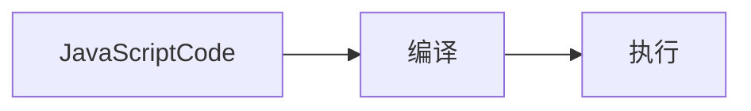

> 1.  JavaScript 代码是按顺序执行吗？先编译、后执行。编译出执行上下文与可执行代码。
## 执行上下文

## 变量提升
```Javascript
console.log(name)
fn();
fn_var();

var name; // 声明
name = 123; // 赋值部分

function fn() {
  console.log('完整的函数声明')
}

var fn_var = function() {
  console.log('匿名函数赋值给变量')
}

// VM791:1
// VM791:8 完整的函数声明
/**
VM791:3 Uncaught TypeError: fn_var is not a function
    at <anonymous>:3:1
(anonymous) @ VM791:3 */
```
<!--more-->

name 和 函数 fn 正确打印出结果，Javascript 代码执行过程中，Javascript 引擎把变量声明部分和函数声明部分提升到代码开头的行为，叫做 **变量提升**。
变量提升后，会给变量设置默认值 undefined。

`Uncaught TypeError: fn_var is not a function` 因为 fn_var 是变量，提升后相当于 `fn_var = undefined`，所以报错，fn_var 不是一个函数。

### JavaScript 代码的执行流程


### 分析以下代码(1)
```JavaScript
var name = "variable promotion";
function showName(){ console.log(name); if(0){ var name = "variable promotion case" } console.log(name);}
showName()

// undefined
// undefined
```

[javascript Code] as js
note left of js: var name = "variable promotion"; \n function showName(){...} \n showName();
package "call stack" as callStack {
  rectangle "execution context of global" {
    rectangle "变量环境"
    note right of "变量环境":name=undefined;\n function showName(){...}
    rectangle "词法环境"
  }
  cloud {
    rectangle "可执行代码"
      note right of "可执行代码":showName();
  }
}
js --> callStack: 编译（compile）


`全局执行上下文压入栈以后，JavaScript 引擎开始执行全局代码。先给 name 变量赋值，再调用函数showName`**调用函数时，javascript 引擎编译该函数，为其创建执行上下文，再将执行上下文压入栈** 结果如下：

[javascript Code] as js
note left of js: var name = "variable promotion"; \n function showName(){...} \n showName();
package "call stack" as callStack {
  rectangle "execution context of global" {
    rectangle "变量环境"
    note right of "变量环境":name="variable promotion";\n showName();
    rectangle "词法环境"
  }
  rectangle "execution context of function showName" {
    rectangle "showName变量环境"
    note right of "showName变量环境": name=undefined
    rectangle "showName词法环境"
  }
}
js --> callStack: 编译（compile）

`函数执行上下文压入栈后，JavaScript 引擎再执行showName函数代码。`最终打印出结果 undefined

### 分析以下代码(2)
```javascript
showName();
var showName = function() {
  console.log(1)
}
```
> VM4235:1 Uncaught TypeError: showName is not a function
* 编译阶段：全局执行上下文环境变量 `showName = undefined` 写入内存，可执行代码 `showName()`
* 执行阶段：代码按顺序执行，先执行第一行 `showName()`，环境变量中存在 showName，值是 undefined，并不是一个函数。所以报错 `showName is not a function`

```javascript
showName();
var showName = function() {
  console.log(1)
}
function showName() {
  console.log(2)
}
```
> 打印出 2
* 编译阶段：第一行 `showName()` 放入可执行代码；第二行声明变量 showName 放入全局执行上下文 `showName = undefined`；第 五 行 `覆盖 showName 赋值 function 引用`
* 执行阶段变量环境中找到 `函数 showName`，打印结果 2，showName 再次赋值 `function() {
  console.log(1)
}`的引用。下次再执行 showName() 打印结果是 1

### 变量提升带来的问题 —— 变量未能及时销毁
```JavaScript
function variableDestruction() {
  for (var i=0; i<5; i++){}
  console.log(i);
}
variableDestruction();
```
JavaScript 编译以上代码，生成全局上下文(环境变量 function variableDestruction(){...})，然后压入栈内存中。JavaScript 执行可执行代码 `variableDestruction()`，创建函数执行上下文(环境变量 i=undefined)，再将函数执行上下文 压入栈内存。javascript 引擎继续执行可执行代码 i 赋值、遍历、打印结果是 6。**因为没有块级作用域，导致遍历结果后没有销毁变量i,所以打印结果是 6**

## 认识JavaScript块级作用域，通过块级作用域解决变量提升的问题
**作用域** 程序中定义变量的区域，该位置决定了变量的生命周期。通俗的理解，作用域是变量与函数的可访问范围，即作用域控制着变量和函数的可见性和生命周期。
ES6 之前两种作用域：
1.  **全局作用域** 中的对象在代码中任何地方都能访问，其生命周期为整个页面的生命周期；
2.  **函数作用域** 函数内部定义的变量或者函数，定义的变量和函数只能在函数内部访问。其生命周期从函数调用到函数执行结束。函数执行结束，函数内部定义的变量销毁。

ES6 之后引入了 let/const 声明关键字，使得 JavaScript 也能像其它语言一样拥有块级作用域了。 **块级作用域**，即使用一对大括号包裹的代码，如：函数、判断语句、循环语句等

`用块级作用域解决变量提升的问题`
```javascript
function variableDestruction() {
  for (let i=0;i<5;i++){}
  console.log(i)
}
variableDestruction();
```
> Uncaught ReferenceError: i is not defined 说明块级作用域生效，i 在 块级作用域以外不能访问。也就是在函数作用域内没有变量提升。


代码执行之前进行编译创建执行上下文的三种情况：
1.  当 JavaScript 执行全局代码的时候，会编译全局代码并创建 **全局执行上下文**。整个页面的生命周期内，全局执行上下文只有一份；
2.  当调用一个函数时，函数体内的代码会被编译，并创建 **函数执行上下文**，一般情况下，函数执行结束后，创建的函数执行上下文被销毁；
3.  当使用 eval 函数的时候，eval 代码也会被编译，并创建执行上下文。

> 调用栈用来管理函数调用关系的一种数据结构。

## 函数调用
## 栈结构 —— 后进先出
通过栈来管理执行上下文。
## 什么是 JavaScript 的栈调用
## 作用域链
## 词法作用域
Javascript 执行过程中其作用域链是由词法作用域决定的。
**词法作用域** 是指作用域是由代码中函数声明的位置来决定的，所以词法作用域是静态的作用域，通过它就能预测代码在执行过程中如何查找标识。
## 闭包
在 JavaScript 中，根据词法作用域的规则，内部函数总是可以访问其外部函数中声明的变量，当通过调用一个外部函数返回一个内部函数后，即使该函数已经执行结束了，但是内部函数引用外部函数的变量依然保存在内存中，我们把这些变量的集合称为闭包。
