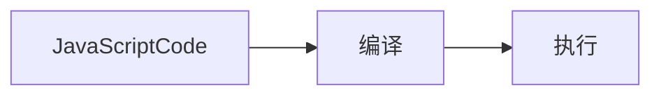

- [ ] JavaScript 代码是按顺序执行吗？先编译、后执行。编译出执行上下文与可执行代码。
  * 变量提升
- [ ] 为什么 JavaScript 代码会出现栈溢出
  * 调用栈 —— 用来管理函数调用关系的一种数据结构。`Maximum call stack size exceeded`
- [ ] var 与 let 和 const，var 缺陷是什么
  * var 会引起变量提升，变量提升产生变量污染、消耗一部分无用的内存。可以通过 let 和 const 解决，ECMAScript6 中，提出的 let 和 const 有块级作用域的概念。很好的解决了变量提升的问题
- [ ] 作用域链与闭包
  * 作用域变量的有效性和生命周期
  * 闭包嵌套函数，内部引用外出变量，外部函数执行结束后，不能完全退栈。内部函数存在外部函数的变量引用
  * this 与变量不同，内部函数不能继承外部函数的 this。解决办法有三种：
    1. this 转换为作用域，将 this 赋值给变量，内部函数访问 this 赋值的变量；
    2. 箭头函数继承上一级的 this
    3. 采用 call/apply/bind 其一，进行对象冒充
    4. 传参
<!--more-->


## 1. 变量提升（Hoisting）
> ~~Javascript 代码执行过程中，Javascript 引擎把变量声明部分和函数声明部分提升到代码开头的行为~~`JavaScript 代码在编译过程中，被 JavaScript 引擎放入内存的行为`，叫做 **变量提升**。

```Javascript
console.log(name)
fn();
fn_var();

var name; // 声明
name = 123; // 赋值部分

function fn() {
  console.log('完整的函数声明')
}

var fn_var = function() {
  console.log('匿名函数赋值给变量')
}

//
// 完整的函数声明
/**
    VM791:3 Uncaught TypeError: fn_var is not a function
    at <anonymous>:3:1
    (anonymous) @ VM791:3
  */
```
> 分析：
  console.log(name) 打印出 undefined 变量提升后，会给变量设置默认值 undefined。
  fn() 执行后打印 完整的函数声明
  fn_var() `Uncaught TypeError: fn_var is not a function` 因为 fn_var 是变量，提升后相当于 `fn_var = undefined`，所以报错，fn_var 不是一个函数。

### 1-1.  JavaScript 代码的执行流程


### 1-2. 分析代码了解代码执行环境
> **执行上下文** javaScript 执行一段代码时的 **运行环境**。
执行上下文中存在一个变量环境的对象（Variable Environment)，variable Environment 中保存了变量提升的内容
#### demo-1-1 分析以下代码
```JavaScript
var name = "variable promotion";
function showName(){
  console.log(name);
  {
    var name = "variable promotion case"
  }
  console.log(name);
}
showName()

// undefined
// undefined
```

如上代码，`编译后会将会将提升的变量 name=undefined; function showName(){...}保存在变量环境中`，如下图

rectangle " " as compileResult {
  stack 全局执行上下文 as executionContextOfGlobal {
    rectangle "变量环境"
    note right of "变量环境": name=undefined;\n function showName(){...}
    rectangle "词法环境" #6f3
  }
  rectangle "可执行代码" as test #f90
    note right of test: showName();
  executionContextOfGlobal -[#transparent]-> test
}


#### demo-1-2.  分析以下代码
```javascript
showName();
var showName = function() {
  console.log(1)
}
```
> VM4235:1 Uncaught TypeError: showName is not a function
* 编译阶段：全局执行上下文环境变量 `showName = undefined` 写入内存，可执行代码 `showName()`
* 执行阶段：代码按顺序执行，先执行第一行 `showName()`，环境变量中存在 showName，值是 undefined，并不是一个函数。所以报错 `showName is not a function`

```javascript
showName();
var showName = function() {
  console.log(1)
}
function showName() {
  console.log(2)
}
```
> 打印出 2
* 编译阶段：第一行 `showName()` 放入可执行代码；第二行声明变量 showName 放入全局执行上下文 `showName = undefined`；第 五 行 `覆盖 showName 赋值 function 引用`
* 执行阶段变量环境中找到 `函数 showName`，打印结果 2，showName 再次赋值 `function() {
  console.log(1)
}`的引用。下次再执行 showName() 打印结果是 1

## 2. 执行上下文与调用栈
代码执行之前进行编译创建执行上下文的三种情况：
1.  当 JavaScript 执行全局代码的时候，会编译全局代码并创建 **全局执行上下文**。整个页面的生命周期内，全局执行上下文只有一份；
2.  当调用一个函数时，函数体内的代码会被编译，并创建 **函数执行上下文**，一般情况下，函数执行结束后，创建的函数执行上下文被销毁；
3.  当使用 eval 函数的时候，eval 代码也会被编译，并创建执行上下文。

**`调用栈用来管理函数调用关系的一种数据结构。`**

### JavaScript 调用栈
栈容器、入栈、出栈、栈中元素后进先出。
JavaScript 引擎创建执行上下文，然后压入 **调用栈**

<style>
arrow {
    LineColor transparent
}
</style>
stack callStack {
  rectangle "函数执行上下文" {
    rectangle "函数变量环境"
    rectangle "函数词法环境"
  }
  rectangle "全局执行上下文" {
    rectangle "全局变量环境"
    rectangle "全局词法环境"
  }
  函数执行上下文 .. 全局执行上下文

}


**`调用栈是 JavaScript 引擎追踪函数执行的一个机制。多个函数被调用时，通过调用栈可以追踪到哪个函数正在被执行以及各个函数之间的调用关系`**

### 2-1-demo. 分析代码
```JavaScript
var name = 'helen zhang';
function showName(callName) {
  console.log(callName)
}
function callShowName() {
  var callName = 'call ' + name
  showName(callName)
}
callShowName();
```

stack " " {
  rectangle "函数showName执行上下文" as showName {
    card "console.log(callShowName)"
  }
  rectangle "函数callShowName执行上下文" as callShowName {
    card "name='call helen zhang';"
  }
  rectangle "全局执行上下文" as globalExecutorContext {
    card "变量环境" as variableEnvironment {
      card "name='helen zhang';\nfunction showName(){...};\nfunction callShowName(){...}"
    }
  }

  showName -[#transparent]->callShowName
  callShowName -[#transparent]->globalExecutorContext
}

> 分析：
1.  JavaScript 引擎编译代码时创建 **全局执行上下文**；
    执行第一行代码时声明变量 name，并赋初值 undefined；
    执行第二行代码时，声明 function showName，将变量 name 和 函数 showName 放入变量环境。
    callShowName() 放入执行代码
2.  执行代码 callShowName()，创建 **函数执行上下文**。
    执行 callName 赋值 ‘undefined’
    showName() 放入执行代码
3.  执行 showName(), 创建 **函数执行上下文**
    console.log(callShowName) 打印 callShowName

以上创建的两个执行上下文是通过 **栈数据结构** 来管理的。

### chrome 开发者工具查看调用栈
1. javascript 代码打断点（debugger）
2. 执行时进入断点
3. 开发者工具右侧 call stack 查看调用栈


anonymous 全局函数入口
中间是 addAll 函数
顶部是 add 函数
在分析复杂代码结构时，或检查 bug 时，调用栈非常有用
runStack 当前调用函数


**`console.trace() 输出函数调用关系`**


## 3. 栈溢出（stack overflow)
`调用栈有大小的`，超出后 JavaScript 引擎会报错`超出最大栈调用大小（Maximum call stack size exceeded）`，**栈溢出**
> 递归没有任何终止条件的函数，会一直创建执行上下文，并反复压入栈中，栈容量有限，超过最大数量后会出现 `Maximum call stack size exceeded`

### 解决栈溢出
递归调用的形式改造成其他形式，或者使用加入定时器的方法来把当前任务拆分为其他很多小任务来解决栈溢出
```JavaScript
function runStack (n) {
  if (n === 0) return 100;
  return setTimeout(function(){
    runStack( n- 2)
  },0);
}
runStack(50000)
```

---
---
var 声明的变量会有 **变量提升** 的特性，与直觉不否。是 JavaScript 的一个重要的设计缺陷。
  由于 JavaScript 需要保持向下兼容，所以变量提升特性还会继续存在

> 下文中 探讨
  * 为什么在 JavaScript 中会存在变量提升
    javaScript 语言最初用最快速、最简单的方式设计，所以没有块级作用域，把块级作用域内部的变量提升。
  * 变量提升所带来的问题
  * 作用域配合 let 和 const 关键字修复变量提升带来的问题
---
---

## 4. 通过 `let/const + JavaScript块级作用域` 解决变量提升的问题
### 4-1.  作用域（scope）
> **作用域** 程序中定义变量的区域，该位置决定了变量的生命周期。通俗的理解，作用域是变量与函数的可访问范围，即作用域控制着变量和函数的可见性和生命周期。

ES6 之前两种作用域：
1.  **全局作用域** 中的对象在代码中任何地方都能访问，其生命周期为整个页面的生命周期；
2.  **函数作用域** 函数内部定义的变量或者函数，只能在函数内部访问。
                 其生命周期从函数调用到函数执行结束。
                 函数执行结束，函数内部定义的变量销毁。

`ES6 之后引入了 let/const 声明关键字，使得 JavaScript 也能像其它语言一样拥有块级作用域了。`
**块级作用域** —— 即使用一对大括号包裹的代码，如：函数、判断语句、循环语句等

### 4-2.  变量提升存在问题 —— 容易在无意识的情况下变量覆盖
第一部分变量提升中说了经过编译，提升变量会存入变量环境（存入内容），现在借 demo-1-1 代码继续分析，变量提升带来的问题
```JavaScript
var name = "variable promotion";
function showName(){
  console.log(name);
  {
    var name = "variable promotion case"
  }
  console.log(name);
}
showName()

// undefined
// undefined
```

stack " " {
  rectangle "execution context of global" as globalContext {
    rectangle "变量环境" {
      card "name="variable promotion";\n showName();"
    }
    rectangle "词法环境"
  }
  rectangle "execution context of function showName" as functionContext {
    rectangle "showName变量环境" {
      card "name=undefined"
    }
    rectangle "showName词法环境"
  }
  functionContext -[#transparent]-> globalContext
}


`全局执行上下文压入栈以后，JavaScript 引擎开始执行全局代码。先给 name 变量赋值，再调用函数showName`
**调用函数时，javascript 引擎编译该函数，为其创建执行上下文，再将执行上下文压入栈**
函数执行上下文压入栈后，JavaScript 引擎再从上到下执行showName函数代码，执行到第一个 console.log(name)取编译时的初值 undefined 打印出 undefined，第二个 console.log(name) 时，因没有块级作用域，所以打印出 variable promotion case

### 4-3.  变量提升存在问题 —— 变量未能及时销毁
```JavaScript
function variableDestruction() {
  for (var i=0; i<5; i++){}
  console.log(i);
}
variableDestruction();
```
JavaScript 编译以上代码，生成全局上下文(环境变量 function variableDestruction(){...})，然后压入栈内存中。JavaScript 执行可执行代码 `variableDestruction()`，创建函数执行上下文(环境变量 i=undefined)，再将函数执行上下文 压入栈内存。javascript 引擎继续执行可执行代码 i 赋值、遍历、打印结果是 5。**因为没有块级作用域，导致遍历结果后没有销毁变量i,所以打印结果是 5**

### 4-4.  用`let/const + JavaScript块级作用域`解决变量提升的问题
ECMAScript6 以前没有如{}，判断语句，循环语句的块级作用域，**ES6 引入 let 和 const 关键字**，用 let 和 const 声明的变量是有块级作用的概念的
let 声明的变量可以被修改，const 声明的变量不可以。

```javascript
function variableDestruction() {
  for (let i=0;i<5;i++){}
  console.log(i)
}
variableDestruction();
```
> Uncaught ReferenceError: i is not defined 说明块级作用域生效，i 在 块级作用域以外不能访问。也就是在函数作用域内没有变量提升。

## 5. ES6 怎么兼容变量提升和块级作用域的
从上下文的角度分析：
```javaScript
function foo(){
  var a = 1;
  let b = 2;
  {
    let b = 3, d = 5;
    var c = 4;
    console.log(a)
    console.log(b)
  }
  console.log(b)
  console.log(c)
  console.log(d)
}
foo()
```
**1.  编译并创建执行上下文**

rectangle fnContext as "foo 函数执行上下文" {
  rectangle lexicalEnvironment as "词法环境" {
    card "b=undefined"
  }
  rectangle variableEnvironment as "变量环境" {
    card "a=undefined;\nc=undefined"
  }
}

>解析
* 函数内部 var 声明的变量，编译时存入 **变量环境**
* let 声明的变量，编译时存入 **词法环境（Lexical Environment）**
* 函数内部的块级作用域内部，通过 let 声明的变量编译阶段未放到词法环境中

**2.  执行代码**

rectangle fnContext as "foo 函数执行上下文" {
  rectangle lexicalEnvironment as "词法环境" {
    card "b=2" as lexical
    card "块级作用域\nb=undefined\nd=undefined" as lexicalBlock
    lexicalBlock -[#transparent]-> lexical

    lexicalBlock-->lexical
  }
  rectangle variableEnvironment as "变量环境" {
    card "a=1;\nc=undefined;"
  }

  lexicalEnvironment --> variableEnvironment
}


创建完词法块级作用域后，
继续执行可执行代码 `console.log(a)`，具体是延着词法环境栈向下查找，有就返回给 JavaScript 引擎，如果词法环境中没有继续在变量环境中找(如上图箭头)。结果打印 1；
`console.log(b)` 打印词法环境中的 `b=3`;块级词法环境出栈。
`console.log(b)`, 打印块级词法环境 `b=2`;
`console.log(c)`打印变量环境中`c=4`;
`console.log(d)` 打印 undefined **因为吧，定义d的作用域已经出栈了**

### Uncaught ReferenceError: Cannot access 'myname' before initialization
```javascript
let myname= 'helen';
{
  console.log(myname);
  let myname= 'zhang';
}
```
**`分析：`** 块级作用域中，myname 声明提升到了 console.log(myname) 之前，但赋初值 undefined 未初提升。所以 `can not access myname before initialization`。**所以 let 声明的变量，声明会被提升，但赋初值不被提升。var 声明的变量，赋默认值都会被提升。function 声明、赋值都会被提升。**
> 变量提升是在变量环境中完成的，而块级作用域是通过词法环境的栈结构实现的，两个结合，JavaScript 就实现了 变量提升与块级作用域了

## 6. 作用域链
> 作用域是程序中定义变量的位置，这个位置决定了变量的可见性或说生命周期
  作用域链可以理解为变量的查找路径

**`outer —— 每个执行上下文的变量环境中用于指向外部的执行上下文的引用。`**

```javascript
var name = 'helen';
function foo() {
  var name = 'zhang';
  bar();
}
function bar() {
  console.log(name)
}
```

stack " " {
  rectangle globalContext as "全局上下文环境" {
    card globalEnvironment as "变量环境\nname='helen'" {
      rectangle "outer = null" as globalOuter
    }
    card "词法环境"
  }
  rectangle fooContext as "foo 函数执行上下文" {
    card "变量环境\nname='zhang'" {
      rectangle "outer" as fooOuter
      fooOuter --> globalContext: 指向全局执行上下文
    }
    card "foo词法环境"
  }
  rectangle barContext as "bar 函数执行上下文" {
    card "变量环境" {
      rectangle "outer" as barOuter
      barOuter --> globalContext: 指向全局执行上下文
    }
    card "bar词法环境"
  }

  barContext -[#transparent]-> fooContext
  fooContext -[#transparent]-> globalContext
}

> 函数调用时，使用了外部变量，通过 function 关键字声明的函数，会延着执行上下文环境向上查找变量，这个路径就是叫做作用域链
**JavaScript 执行过程中，其作用域链是由词法作用域决定的。**

### 6-1. 词法作用域
**词法作用域** 是指作用域是由代码中函数声明的位置来决定的，所以词法作用域是静态的作用域，通过它就能预测代码在执行过程中如何查找标识。
> 词法作用域是代码编译阶段就决定好的，和函数是怎么调用没有关系

```javaScript
var a = 'a'
var b = 'b'
function afn() {
  console.log(a, b)
}

function bfn() {
  var b = 'bb'
  cfn()
  function cfn() {
    console.log(b)
    dfn()
  }
}

function dfn() {
  console.log(b)
  afn();
}

bfn()
// bb
// b
// a b
```
> 分析：
  编译：全局变量环境中（a=undefined;b=undefined;function afn(){...};function bfn(){...};function dfn(){...}）
  执行：a='a';b='b';执行bfn()
  编译：bfn函数变量环境（b=undefined; function cfn(){...}）**cfn 函数声明的位置在 bfn 函数内部**
  执行：b='bb'；函数 cfn 中打印变量 b 为 bb，调用 dfn 函数，**dfn 函数声明的位置在全局上下文中，打印变量 b 为全局上下文环境中的变量 b，结果为 b**，接着在 dfn 中调用 afn，同样 afn 是在全局上下文环境中声明，所以打印全局上下文中的变量 a


### 6-2. 块级作用域的变量查找
```javascript
function bar() {
  var myName = "极客世界"
  let test1 = 100
  if (1) {
    let myName = "Chrome浏览器"
    console.log(test)
  }
}
function foo() {
  var myName = "极客邦"
  let test = 2
  {
    let test = 3
    bar()
  }
}
var myName = "极客时间"
let myAge = 10
let test = 1
foo() // 1
```

stack " " {
  rectangle 全局执行上下文环境 as globalContext {
    card "变量环境\nfunction bar\nfunction foo\nmyName='极客时间'" {
      rectangle outer
      cloud 5
    }
    card "词法环境\nmyAge=10;\ntest=1"{
      cloud 4
    }
  }
  rectangle foo函数执行上下文环境 as fooFunctionContext {
    card "变量环境" {
      rectangle “myName='极客邦'”
      rectangle fooOuter
    }
    card "词法环境" {
      rectangle "test=2"
      card "foo 块级作用域\ntest=3"
    }
  }
  rectangle bar函数执行上下文环境 as barFunctionContext {
    card "变量环境'" as barVariableEnvironment {
      rectangle "myName='极客世界"
      rectangle "barOuter"
      cloud 3
    }
    card "词法环境" {
      rectangle "myName='chrome浏览器'" as Barlexical{
        cloud 2
      }
      rectangle "块级作用域词法环境\ntest1=100" as BlockLexical {
        cloud 1
      }

      BlockLexical -[#transparent]-> Barlexical
    }
  }

  barFunctionContext -[#transparent]-> fooFunctionContext
  fooFunctionContext -[#transparent]-> globalContext
}

>分析:
 console.log(test)
 1. if 块级词法环境中查找 —— 无
 2. bar 函数词法作用域中查找 —— 无
 3. bar 函数变量环境中查找 —— 无
 4. **bar 在全局作用域中声明的，outer 执行上下文引用指向全局执行上下文，** 首先在全局执行上下文词法环境中查找 —— 找到了，打印 1；若无在，全局执行上下文变量环境中查找

## 7. 闭包
> **在 JavaScript 中，根据词法作用域的规则，内部函数总是可以访问其外部函数中声明的变量，当通过调用一个外部函数返回一个内部函数后，即使该函数已经执行结束了，但是内部函数引用外部函数的变量依然保存在内存中，我们把这些变量的集合称为`闭包`。**

```javascript
function foo() {
  var myName = '极客时间'
  let test1 = 1
  const test2 = 2
  var innerBar = {
    getName: function() {
      console.log(test1)
      return myName
    }
    setName: function(newName) {
      myName = newName
    }
  }
  return innerBar
}
var bar = foo()
bar.setName('极客邦')
bar.getName()
console.log(bar.getName())
```

>分析：
 foo 函数调用结束后，foo 函数中定义的 getName 函数，依然引用了 foo 函数中的变量 test1 和 myName 造成 foo 函数无法完全退栈。就行成了一个闭包

**函数内部方法包含外部引用，函数无法完全退栈，内部方法引用外部函数的变量依然保存在内存中，就形成了一个闭包**
```javascript
closure(foo)
  name: '极客邦'
  test1: 1
```

### 7-1.  闭包怎么回收
闭包使用不正确会造成内存泄漏，如果引用闭包的函数是个全局变量，闭包会一直存在直到页面关闭；如果不在使用就会造成内存泄漏。引用闭包的函数是个局部变量，等函数销毁后，在下次 JavaScript 引擎执行垃圾回收时，判断闭包这块内容不被使用，那么 Javascript 引擎垃圾回收器会回收这块内存。使用闭包原则 **如果闭包会一直使用，那么它可以作为全局变量存在；如果使用频率不高，占用内存又大，就尽量让它成为一个局部变量**

## 8. JavaScript 中的 this 是什么
```javaScript
var name = 'variable name';
var bar = {
  name: 'the variable name of bar',
  printName: function() {
    console.log(name)
  }
}
function foo() {
  return bar.printName
}
var _printName = foo()
_printName()
```
执行以上代码片断，打印的结果为 `variable name`。按照其它语言的编程习惯，这里想打印的是 `bar.name` 即 `the variable name of bar`
> 分析：
  全局上下文中有两个变量 bar 和 name
  bar 有两个属性，name 和 function printName
  JavaScript 中的作用域链是由词法作用域决定的，而词法作用域是由代码结构决定的。
  所以 function(){console.log(name)} 这个函数是在全局上下文环境中定义的，foo 函数中取的是全局执行上下文中定义的函数
  全局上下文环境中取 name 变量，打印的结果为 ‘variable name’

**`可以通过使用 javaScript this 机制获取对象内部属性`**
```javaScript
var bar = {
  name: 'the variable name of bar',
  printName: function() {
    console.log(this.name)
  }
}
bar.printName() // the variable name of bar
```


rectangle 执行上下文 {
  card 变量环境 #66f
  card 词法环境 #66f
  card outer #66f
  card this #f33
}

**this 是和执行上下文绑定的**，即每个执行上下文中都有一个 this

### 8-1.  全局执行上下文 this
浏览器环境，全局执行上下文 this 指向 window 对象，window 是 this 和 作用域链的唯一交点，作用域链最低端包含了 window 对象
### 8-2.  函数执行上下文 this
```javaScript
function foo() {
  console.log(this)
}
foo() // window
```
在全局执行环境中调用函数，其执行上下文中的 this 指向 window 对象。this 指向可以被设置
### 8-3.  设置执行上下文 this 的几种方式
1. 通过函数的 call 方法，对象冒充，改变 this 指向
```JavaScript
var name = 'zhang'
var bar = {
  name: 'helen'
}
function foo() {
  console.log(this.name)
}
foo()
foo.call(bar)
```
  > 分析：
    代码编译结果 `name=undefined;bar=undefined;function foo(){...}`
    代码执行：`name='zhang';bar={name: helen}` 执行 `foo()` this 指向 window，取全局环境中的 name ，打印 'zhang'
    执行 `foo.call(bar)` 对象冒充，使得 foo 函数中的 this 指向 bar 对象，打印 'helen'

  除了用 call 改变 this 指向问题，还可以使用 **bind**、**apply**，具体就是使用上的区别

2. 通过 **对象调用** 改变 this 指向
```javascript
var name = 'zhang'
var myObj = {
  name: 'helen',
  showName: function() {
    console.log(this.name)
  }
}
myObj.showName() // 'helen'
```
  **`使用对象调用对象内部方法，this 指向对象本身`** 也可以理解为 `myObj.showName.call(myObj)`
  > this 指向取决于调用者，全局环境调用 this 指向 window，对象调用，this 指向调用对象

3. 通过构造函数中设置
```javascript
function ConstructorObj() {
  this.name = 'helen';
  console.log(this)
}
var obj = new ConstructorObj() // ConstructorObj {name: "helen"}
```
  可以理解为以下代码
  ```javaScript
  // 创建临时空对象
  var temporaryObject = {}
  // 调用 ConstructorObj.call(temporaryObject) this 指向 ConstructorObj 执行上下文
  ConstructorObj.call(temporaryObject)
  // 执行 ConstructorObj 函数，ConstructorObj 函数执行上下文中 this 指向 temporaryObject
  // return temporaryObject
  return temporaryObject
  ```

### 8-4.  this 的设计缺陷及应对方案
1. 嵌套函数中的 this 不会从外层函数中继承
```javaScript
var bar = {
    name: 'hellen',
    fn: function() {
        console.log(this.name) // hellen
        function bar() {
            console.log(this.name) // undefined
        }
        bar()
    }
}
bar.fn()
```
  `function bar(){}` this 指向 window 并没有继承 object bar
  > 解决办法（一） **this 转换为作用域**
  ```javaScript
  var bar = {
      name: 'hellen',
      fn: function() {
          console.log(this.name) // hellen
          var _this = this;
          function bar() {
              console.log(_this.name) // hellen
          }
          bar()
      }
  }
  bar.fn()
  ```
  > 解决办法（二）：**箭头函数 继承 this**
    箭头函数不会创建自身执行上下文，箭头函数 this 取决于其外部函数

  ```javaScript
  var bar = {
    name: 'helen',
    fn: function() {
      console.log(this.name); // helen
      var bar = ()=>{
        console.log(this.name); // helen
      }
      bar()
    }
  }
  bar.fn()
  ```
2. 普通函数中的 this 默认指向全局对象 window
   **JavaScript 严格模式下，全局调用一个函数 this 指向 undefined**

## 9 关于 this 的 demo 分析
需求：异步修改用户信息
```JavaScript
let userInfo = {
  name:"jack.ma",
  age:13,
  sex:'male',
  updateInfo:function(){
    //模拟xmlhttprequest请求延时
    setTimeout(function(){
      this.name = "pony.ma"
      this.age = 39
      this.sex = 'female'
    },100)
  }
}
userInfo.updateInfo()
console.log(userInfo)
```
> 分析：
  执行结果并不是修改用户信息，而是在全局 window 创建了 name/age/sex 属性并赋上相应的值
  具体原因正是函数中 this 的不继承性

### 解决办法：

1.  增加变量 `_this` 保存父级 this（userInfo 这个对象），这种方式会产生一个闭包
```javascript
let userInfo = {
  name:"jack.ma",
  age:13,
  sex:'male',
  updateInfo:function(){
    var _this = this
    //模拟xmlhttprequest请求延时
    setTimeout(function(){
      _this.name = "pony.ma"
      _this.age = 39
      _this.sex = 'female'
    },100)
  }
}
userInfo.updateInfo()
console.log(userInfo) //{name: "jack.ma", age: 13, sex: "male", updateInfo: ƒ}
```
2.  call/apply/bind 对象冒充
```javascript
let userInfo = {
  name:"jack.ma",
  age:13,
  sex:'male',
  updateInfo:function(){
    //模拟xmlhttprequest请求延时
    setTimeout(function(){
      this.name = "pony.ma"
      this.age = 40
      this.sex = 'female'
    }.call(this),100)
  }
}
userInfo.updateInfo()
console.log(userInfo) //{name: "jack.ma", age: 13, sex: "male", updateInfo: ƒ}
```
3.  箭头函数，箭头函数不会自己创建 this，可以从上级执行上下文环境中继承 this
```javascript
let userInfo = {
  name:"jack.ma",
  age:13,
  sex:'male',
  updateInfo:function(){
    //模拟xmlhttprequest请求延时
    setTimeout(() => {
      this.name = "pony.ma"
      this.age = 41
      this.sex = 'female'
    },100)
  }
}
userInfo.updateInfo()
console.log(userInfo) //{name: "jack.ma", age: 13, sex: "male", updateInfo: ƒ}
```
4.  传参
```javascript
let userInfo = {
  name:"jack.ma",
  age:13,
  sex:'male',
  updateInfo:function(){
    //模拟xmlhttprequest请求延时
    setTimeout(function(_this){
      _this.name = "pony.ma"
      _this.age = 42
      _this.sex = 'female'
    }(this),100)
  }
}
userInfo.updateInfo()
```
