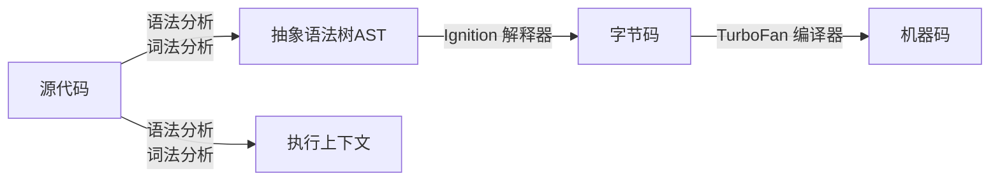
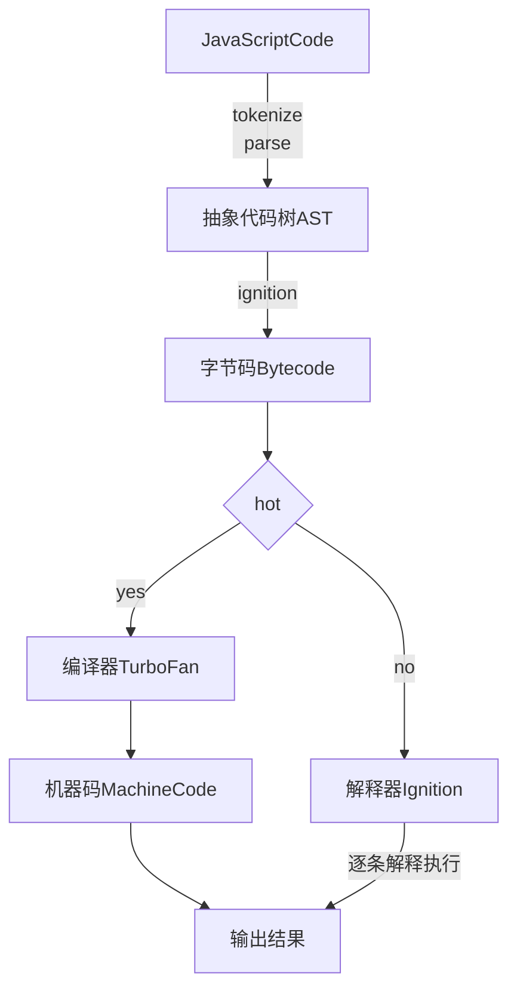

JavaScript 内存机制
- [ ] JavaScript 内存中的存储
- [ ] 处理垃圾回收
- [ ] v8 中执行

## 1. JavaScript 是什么类型的语言
**静态语言** 在使用之前就需要确认其变量数据类型。如 C 语言
**动态语言** 在运行过程中需要检查数据类型的语言。如 JavaScript
**弱类型语言** 运行过程中支持隐式转换的语言。C 和 JavaScript 都支持隐式转换，都是弱类型语言
**强类型语言** 运行过程中不支持隐式转换的语言。如 Ruby
【具体可参考以下象限图】

<!--more-->

## 2. JavaScript 7 种数据类型
> JavaScript 是弱类型动态语言，不需要在使用前定义变量类型，运行过程中同一变量可以存不同数据类型

|类型|描述|
|---|---|
|Number|可以是整数或带小数点的浮点数，采用 IEEE 754 双精确度（64 位）格式存储，计算浮点数时，需要注意 0.1+0.2=0.30000000000000004|
|String|0或0个以上字符由，''或""包裹。原字符串不是对象类型，为方便使用，JavaScript引擎会自动转成对象类型，有 length 属性|
|Boolean|任何类型都会转成布尔类型，false,0,'',NaN, null, undefined 转换为 false; 其它转换为 true。|
|Undefined|变量未声明或声明未赋值 typeof a === 'undefined'(a 是不存在的变量)|
|Null|空值，清除某个值时可赋值为 null|
|Object|Function,Array,Date 等，都为对象类型。JavaScript 中的对象可以看作是属性的集合|
|Symbol|符号类型，是唯一的并且不可修改，常作为 Object 的 key。通过 Symbol() 函数产生|

几点注意事项：
* typeof Null 返回 Object，这个是 JavaScript bug，为兼容老代码一直未修复；
* isNaN(Number('hello')) // true 检查无意义的运算，NaN 无效的数字。
* 非严格模式下，null === undefined 是 true，严格模式下 false。
* isFinite(2/0) 检查是 2/0 否为有限数
* Object 是引用类型，其它为原始类型。

## 3. 内存空间
JavaScript 执行过程中，主要有三种内存空间，分别是代码空间、栈空间、堆空间。

card 内存模型 #fff [
<b><color:blue>代码空间——可执行代码</color></b>
----
<b><color:green>栈空间（调用栈）—— 存储执行上下文</color></b>
----
<b><color:red>堆空间</color></b>
]


```JavaScript
function foo() {
  var a = 1;
  var b = 'memory space';
  var c = {name: 'helen'}
  var d = c;
}
```


map heap {
 变量名 => 变量值
 1101 =>
 ... =>
 1104 => {name: 'helen'}
}

stack 调用栈 {
  card "foo 函数执行上下文" #66f {
    map foo变量环境 #fff {
      变量名 => 变量值
      a => 1
      b => memory space
      c *-> heap
      c => 1104
      d *-> heap
      d => 1104
    }

    map foo词法环境 #fff {
      变量名 => 变量值
    }
  }
  card "全局执行上下文" #66f {
    map 变量环境 #fff {
     变量名 => 变量值
     function foo => function() {...}
    }
    map 词法环境 #fff {
     变量名 => 变量值
    }
  }
  foo变量环境 -[#transparent]-> 变量环境
}

**
对象类型是存储在 heap，stack 中保存对象引用地址，JavaScript 通过栈中的引用地址访问。
> 原始类型保存的栈中，对象类型保存在堆中。堆中只保存对象类型的引用地址，JavaScript引擎通过栈的引用地址进行访问

JavaScript 引擎是需要用栈来维护程序执行期间上下文的状态，如果栈空间太大，所有的数据都存放在栈里，会影响上下文的切换效率，进而影响到整个程序的执行效率。
如上 demo，foo 函数结束后，foo 函数执行上下文会被回收，指针移动到全局执行上下文。
所以通常情况下 **栈如果设置过大，会影响切换效率，所以栈是用存放一些原始类型的小数据**，引用类型数据占用空间较大，故这类数据会存在在堆中，**堆空间大，存放数据多。但分配内存和回收内存占时间长**
JavaScript 中，`原始类型的赋值会完全复制变量的值，而引用类型的赋值是复制引用地址`

```JavaScript
function foo() {
  var name = 'helen'
  let test1 = 1
  let test2 = 2
  var innerBar = {
    setName: function(newName) {
      name = newName
    },
    getName: function() {
      console.log(test1)
      return name
    }
  }

  return innerBar
}

var bar = foo()
bar.setName('zhang')
console.log(bar.getName())
```
1.  当 JavaScript 引擎执行 foo 函数时，会先编译，创建空执行上下文；
2.  编译内部函数 setName 时，由于内部函数引用外部函数变量，于是堆内存空间创建一个 “closure(foo)” 保存变量 name;
3.  编译内部函数 getName 时，函数内部引用了外部函数变量 test1，于堆内存中的 “closure(foo)” 保存变量 test1
4.  foo 函数执行结束后，返回的 getName, setName 与 closure(foo) 存在引用关系。
> 产生闭包的核心有两步：一是需要预扫描内部函数；二是把内部函数引用 的外部变量保存在堆内存中

JavaScript 中变量没有数据类型，只有值有数据类型

## 4. 垃圾回收
### 4-1. 垃圾回收策略 —— **手动回收**
C/C++ 是使用手动回收策略，何时分配内存、何时销毁内存都是由代码控制
```C
//在堆中分配内存
char* p = (char*)malloc(2048);  //在堆空间中分配2048字节的空间，并将分配后的引用地址保存到p中
//使用p指向的内存
{
  //....
}
//使用结束后，销毁这段内存
free(p)；
p = NULL；
```
C 语言，使用 malloc 函数分配内存，然后再使用。如果不再需要这块数据，使用 free 函数来释放内存。如果这段数据不再需要，又没有主动调用 free 函数销毁，就会发生 **内存泄漏**

### 4-2. 垃圾回收策略 —— **自动回收**
Java、JavaScript、Python 等语言，产生的垃圾数据是由垃圾回收器来释放的，不需要手动释放。

### 4-2-1. 调用栈中的数据是如何回收的

## 编译器和解释器
执行程序前，需要将代码翻译成机器能的语言。根据语言的执行流程，可分为编译型语言和解释型语言。
**编译型语言** 在程序执行之前，需要经过编译器编译的过程，并且编译之后会直接保留机器能懂的二进制文件，这样每次运行程序时，都可以直接运行该二进制文件，这样每次运行程序时，都可以直接运行该二进制文件，而不需要每次重新编译。

**解释型语言** 在每次运行时都要通过解释器对程序进行动态解释和执行


## JavaScript 是属于解释型语言， V8 是如何执行一段 JavaScript 代码的？

### 抽象语法树 AST
```JavaScript
var name = 'helen';
function foo() {
  return 123
}
name = 'zhang';
foo();
```
以上代码经过 JavaScript-ast 处理后，生成 ast 结构：

@startmindmap
* Program
** VariableDeclaration
*** VariableDeclarator
****_ myname
****_ helen
** Function foo()
*** BlockStatement
**** ReturnStatement
*****_ 123
** ExpressionStatement
*** =
****_ name
****_ zhang
** ExpressionStatement
*** CallExpression
****_ foo
****_ arguments
@endmindmap


#### AST 的使用
1.  Babel 的工作原理就是先将 ES6 源码转换成 AST，然后再将 ES6 语法的 AST 转换为 ES5 语法的 AST，最后利用 AST 生成 JavaScript 源码。
2.  用来检查 JavaScript 编写规范的插件 ESLint，检查流程也是需要将源码转换为 AST，然后再利用 AST 来检查代码规范化的问题。

#### AST 的生成
1.  分词（tokenize）又称词法分析。将源码拆解为 token。
  `var name = 'helen'` 拆解为以下四个 token
  * keyword 关键字 var
  * name 标识符 identifier
  * argument 赋值运算符 =
  * literal 字符串 helen
2.  解析（parse）语法分析。将 token 根据语法规则转为 AST。若源码存在语法错误，终止，抛出“语法错误”

### 生成字节码
解释器 ignition 将 AST 生成字节码，并解释执行字节码。
早期 v8 没有字节码，是直接将 AST 转换为机器码，机器码执行效率非常高。
随着 Chrome 在手机上运行，特别是 512M 内存的手机上，V8 需要消耗大量内存存放转换后的机器码。字节码就是为解决内存问题而生的。
**字节码是介于 AST 和机器码之间的一种代码。与特定类型的机器码无关，字节码需要通过解释器 ignition 转换为机器码后才能执行**

### 执行代码
解释器 ignition 生成字节码，并逐条解释执行字节码。
Ignition 执行过程中，如果发现有热点代码（HotSpot）（重复执行多次的代码），那么后台的编译器（TurboFan）会把该段热点的字节码编译为高效的机器码，再次执行这段代码时，只需要执行编译后的机器码。大大提高了执行效率。
字节码配合解释器和编译器的技术称为 **即时编译（JIT）** 即，解释器在解释执行代码同时发现热点代码，TurboFan 把热点字节码转换为机器码，并保存转换后的机器码，以便下次使用。

#### 即时编译（JIT）JavaScript + ignition + TurboFan 工作过程


## JavaScript 性能优化
优化中心在单次脚本执行时间和脚本的网络下载上，主要关注三点：
1.  提升单次脚本的执行速度，避免 JavaScript 的长任务霸占主线程，这样可以使页面快速响应交互；
2.  避免大的内联脚本，因为解析 HTML 的过程中，解析和编译会占用主线程；
3.  减少 JavaScript 文件的容量，因为更小的文件会提升下载速度，并且占用更低的内存。
