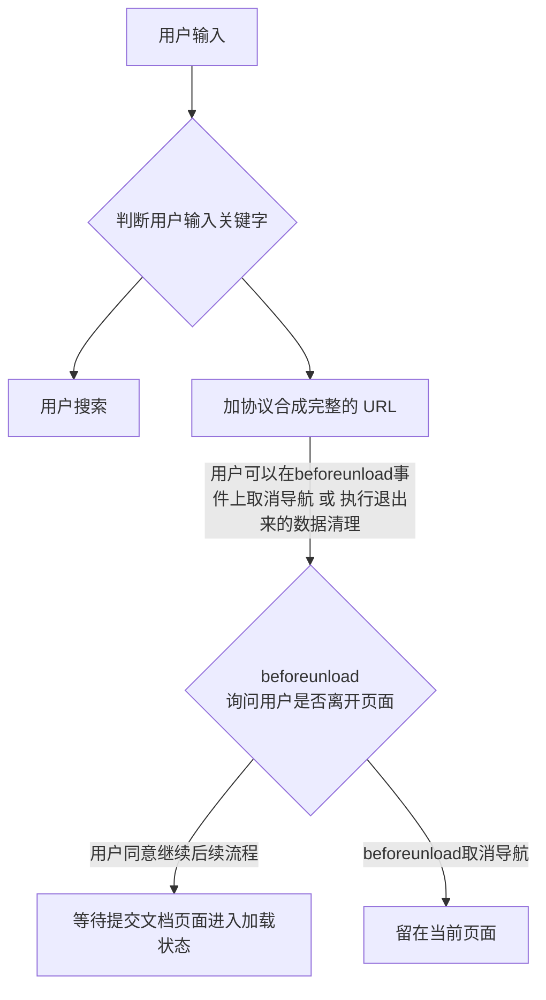
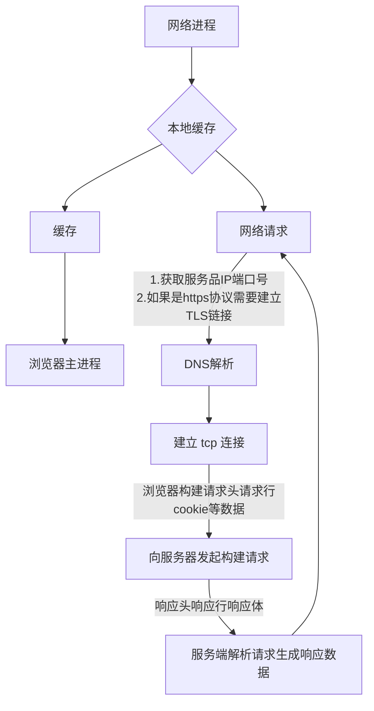
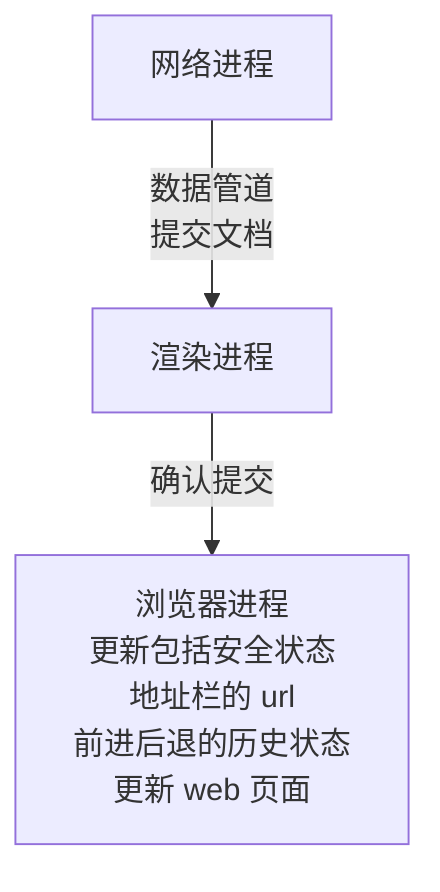

## 1. 用户输入

<!--more-->
## 2. URL 请求过程
浏览器会通过进程间通信（IPC) 把 url 请求发送至网络进程。接下来网络进程发起真正的 url 请求流程。

1.网络进程首先要找缓存，如果有缓存，直接返回资源给浏览器进程；
2.没有缓存资源，则进程 dns 解析，拿到 ip 和 端口。若 https 请求，还需要建立 TLS 连接；
3.建立 tcp 链接，浏览器构建请求行、请求头，并把和该域名相关的 cookie 等数据加入请求头；
### 重定向
接收到服务器的响应头后，网络进程开始解析响应头，如果发现返回的状态码 301 或 302，说明需要浏览器重定向到其它 url, 这里网络进程会从响应头的 location 字段中读取重定向的地址，再次发起请求。
```
HTTP/1.1 302 Found
Server: Tengine
Date: Tue, 17 Nov 2020 09:05:14 GMT
Content-Type: text/html
Content-Length: 258
Connection: keep-alive
Location: http://www.taobao.com/
```

```
HTTP/1.1 307 Internal Redirect
Location: https://www.taobao.com/
Non-Authoritative-Reason: HSTS
```
`content-type` 返回的数据类型，`text/html` 返回的是 html 类型，浏览器会继续渲染。如果 `content-type: application/octet-stream` 类型，那么显示的数据是字节流类型的。请求会被提交给**浏览器的下载管理器，同时 url 结束导航**

## 3. 准备渲染进程
### 同一站点（same-site）
根域名加上协议，还包括根域名下的所有子域名和不同端口。都为**同一站点**

### process-per-site-instance
默认一个标签对应一个渲染进程，如果从一个页面打开另一个新页面，而新页面和当前页面属于同一站点的话，那么新页面复用父页面的渲染进程。

## 4. 提交文档
提交文档是指浏览器进程将网络进程接收到的 HTML 数据提交给渲染进程。


## 5. 渲染阶段

## 时序图

box "browser main process"
participant userInput
participant handleInputData
participant urlNavigator
participant Redirect
participant prepareRenderProcess
participant confirmDocumentSubmited
participant webPageLoaded
end box

box "network process"
participant sendURLRequest
participant readResponseHeader
participant readResponseBody
end box

box "render process"
participant submitDocument
participant parsePageAndLoadSource
end box

userInput -> handleInputData: 是用户搜索还是 url 导航
handleInputData --> urlNavigator
urlNavigator --> sendURLRequest: 通过 IPC 与网络进程通信
note right
浏览器构建请求头、
请求行、
向服务器发送的 cookie
等数据
end note
readResponseHeader --> Redirect: 301 或 302 或 307 服务器说明需要重定向
Redirect --> sendURLRequest
readResponseHeader --> prepareRenderProcess
prepareRenderProcess --> submitDocument
submitDocument --> confirmDocumentSubmited
readResponseBody --> parsePageAndLoadSource
parsePageAndLoadSource --> webPageLoaded

