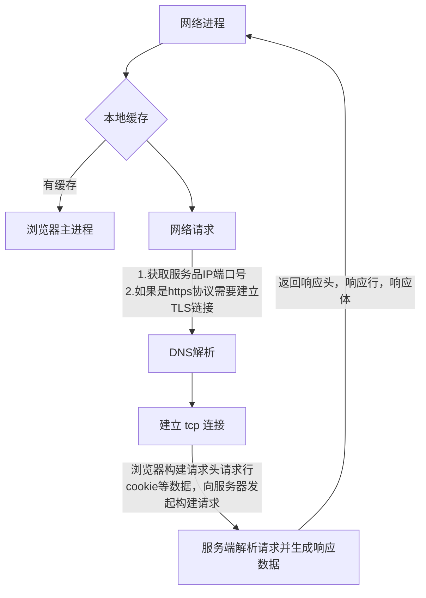
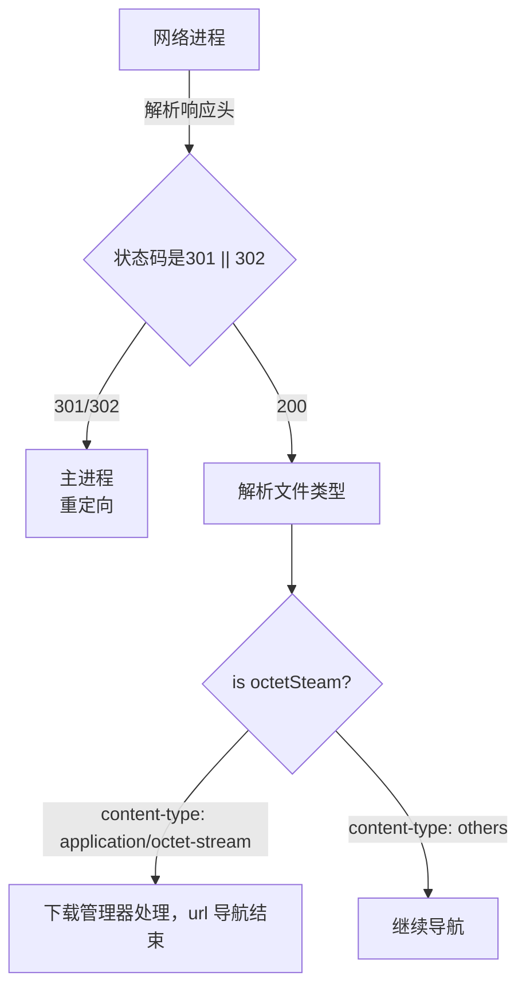
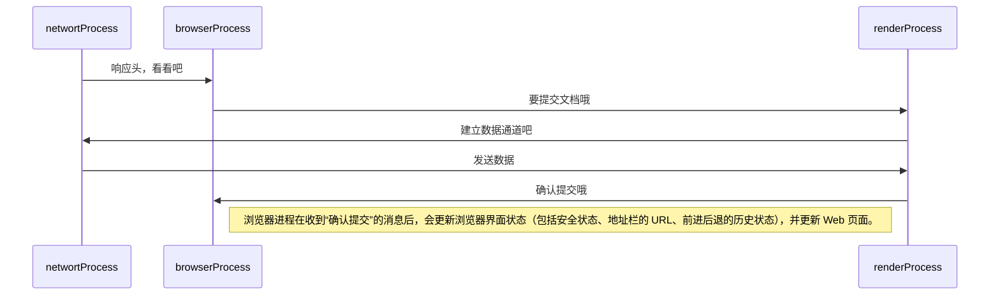


|#a33|浏览器主进程|
start
#lightgreen:**用户输入**;
:处理输入内容;
:**导航**;
|#3aa|网络进程|
#lightgreen:**发起 url 请求**;
|网络进程|
:读取响应头,拉起响应体数据;
|浏览器主进程|
#lightgreen:**准备渲染进程**;
|#aa3|渲染进程|
#lightgreen:**提交文档**;
|浏览器主进程|
:确认文档被提交;
|渲染进程|
:页面解析和子资源加载;
|浏览器主进程|
:页面加载完成;
stop


**导航：用户输入url请求到页面解析的整个过程**

1.	浏览器主进程接收用户输入 url，主进程将 url 转发给网络进程；
2.	网络进程发起 url 请求后网络进程接收响应头数据并解析响应头数据，并将数据发送浏览器主进程；
3.	

## 1. 浏览器主进程 —— 处理用户输入
浏览器地址栏进行以下操作
<div style="background: #fff">
	```mermaid
	graph TD;
		E{beforeunload}
		A(fa:fa-user 用户输入) --> B{判断用户输入关键字}
		B -->|用户搜索| C[搜索引擎会合成带搜索关键字的 url]
		B -->|符合 url 规则| D[加协议合成完整的 URL]
		C --> E
		D --> E
		E --> |用户同意继续后续流程|F[等待提交文档页面进入加载状态]
		E --> |beforeunload取消导航|G[留在当前页面]
	```
</div>
`beforeunload 允许退出前清除数据；或询问用户是否离开`
<!--more-->

## 2. 网络进程 —— URL 请求过程
浏览器主进程会通过进程间通信（IPC) 把 url 请求发送至网络进程。接下来网络进程发起真正的 url 请求流程。
<div style="background: #fff">

</div>

1.	网络进程第一步要找缓存，如果有缓存，直接返回资源给浏览器主进程；否则进程 dns 解析，获取 ip 和 端口。
2.	第二步，**通过 ip 与 服务器 建立 tcp 链接**，若 https 请求，还需要建立 TLS 连接；
3.	然后浏览器构建请求行、请求头，并把和该域名相关的 cookie 等数据加入请求头；
4.	接着向服务器发送请求信息；
5.	最后服务器根据请求生成响应信息（响应头，响应体，响应行等），并发给网络进程

### 网络进程 —— 解析响应头
```bash
$ curl -I http://taobao.com/

# 返回以下响应信息
# HTTP/1.1 302 Found
# Server: Tengine
# Date: Tue, 17 Nov 2020 09:05:14 GMT
# Content-Type: text/html
# Content-Length: 258
# Connection: keep-alive
# Location: http://www.taobao.com/
```
#### 状态码（status code）
以上为访问 http://taobao.com 返回的响应头，网络进程开始解析响应头，状态码 302，网络进程从响应头中取 location 中取地址 `重定向` 到 http://www.taobao.com（状态码 301 同理）
响应状态码 200，响应头继续解析。[状态码详解](https://helenzhanglp.github.io/2019/06/12/http-%E8%AF%B7%E6%B1%82%E7%8A%B6%E6%80%81%E7%A0%81/)

#### 响应类型（content-type）
`content-type` 返回的数据类型
`text/html` 返回的是 html 类型，浏览器会继续渲染。
如果 `content-type: application/octet-stream` 类型，那么显示的数据是字节流类型的。请求会被提交给**浏览器的下载管理器，同时 url 结束导航**
<div style="background: #fff">

</div>


## 3. 准备渲染进程
### 同一站点（same-site）
> 根域名 + 协议，一致的站点都是**同一站点**。
* 根域名 taobao.com
* 协议 （http/https）

```
http://www.taobao.com
http://ali.taobao.com:8888
```
**以上两个 url 属于同一站点，虽然子域名和端口号不同。即是否同一站点，只需要判断根域名与协议是否一致**


### process-per-site-instance
默认一个标签对应一个渲染进程，同一站点，会有渲染进程合并的情况，称为 process-per-site-instance

## 4. 提交文档
提交文档是指浏览器进程将网络进程接收到的 HTML 数据提交给渲染进程。


## 时序图

box "browser main process"
participant userInput
participant handleInputData
participant urlNavigator
participant Redirect
participant prepareRenderProcess
participant confirmDocumentSubmited
participant webPageLoaded
end box

box "network process"
participant sendURLRequest
participant readResponseHeader
participant readResponseBody
end box

box "render process"
participant submitDocument
participant parsePageAndLoadSource
end box

userInput -> handleInputData: 是用户搜索还是 url 导航
handleInputData --> urlNavigator
urlNavigator --> sendURLRequest: 通过 IPC 与网络进程通信
note right
浏览器构建请求头、
请求行、
向服务器发送的 cookie
等数据
end note
readResponseHeader --> Redirect: 301 或 302 或 307 服务器说明需要重定向
Redirect --> sendURLRequest
readResponseHeader --> prepareRenderProcess
prepareRenderProcess --> submitDocument
submitDocument --> confirmDocumentSubmited
readResponseBody --> parsePageAndLoadSource
parsePageAndLoadSource --> webPageLoaded

