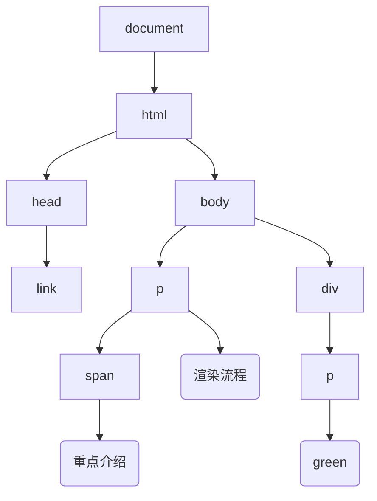

按照渲染的时间顺序，流水线可分为如下几个阶段：构建 DOM 树、样式计算、布局阶段、分层、绘制、分块、光栅化和合成。
1. 将 HTML 转换为浏览器能够理解的结构 —— DOM 树

2.  样式计算（Recalculate Style）
计算出 DOM 节点中每个元素的具体样式，分三步完成：
* 渲染引擎接收到 css 文本时，会执行一个转换操作，将 CSS 文本转换为浏览器可以理解的结构 —— styleSheets。document.styleSheets 可以查看样式 表包含的多种样式。
* 属性值的标准化操作。将属性值 2em/blue/bold 转换为渲染引擎容易理解的、标准化的计算值。
* 根据 css 的继承规则和层叠规则，计算出 Dom 树每个节点的具体样式。css 继承每个 dom 节点都包含父节点样式。

图中，可以看出，样式表的继承关系， user agent styleSheets 是浏览器内置的默认样式
可以在 chrome 开发者工具 ——> 选择 element，再选择 computed 子标签

3. 布局
计算出 DOM 树中可见元素的几何位置，**布局**。额外构建一棵只包含可见元素布局树。

rectangle generateLayoutTree <<生成布局树>> {
  rectangle DOM <<dom>>
  rectangle ComputedStyle <<computed style>>
}
generateLayoutTree -> [body]
note left of [body]
font-size: 20px
end note
[body]-->[p]
note left of [p]
font-size: 20px
color:rgb(0,0,255)
end note
[body]-->[div]
note right of [div]
font-size: 20px
font-weight: 700
color:rgb(255,0,0)
end note
[p]-->渲染流程
[div]-->[div1]
note left of [div1]
font-size: 20px
font-weight: 700
color:rgb(255,0,0)
end note
[div1]-->red

布局树中忽略 head,display:none 的隐藏元素。

**总结：** html 页面内容被提交给渲染引擎，渲染引擎首先将 html 解析为浏览器可以理解的 DOM，接着根据 css 样式表计算出 DOM 树的所有节点的样式；最后计算出元素的几何坐标，将信息保存在 dom 树中。

4. 图层
渲染引擎还需要为特定的节点生成专用的图层，并生成一查对应的图层树（LayerTree），chrome 开发者工具，选择 layer 标签，可查看页面分层情况。
* 拥有层叠上下文的元素会被提升为单独的一层。
z-index/position:fixed/filter/opacity
* 需要剪裁（clip）的地方也会被创建为图层 overflow: auto

5. 图层绘制
渲染引擎实现图层绘制，会把一个图层的绘制拆分成很多小的 **绘制指令**，然后再把这些指令按照顺序组成一个待绘制列表
