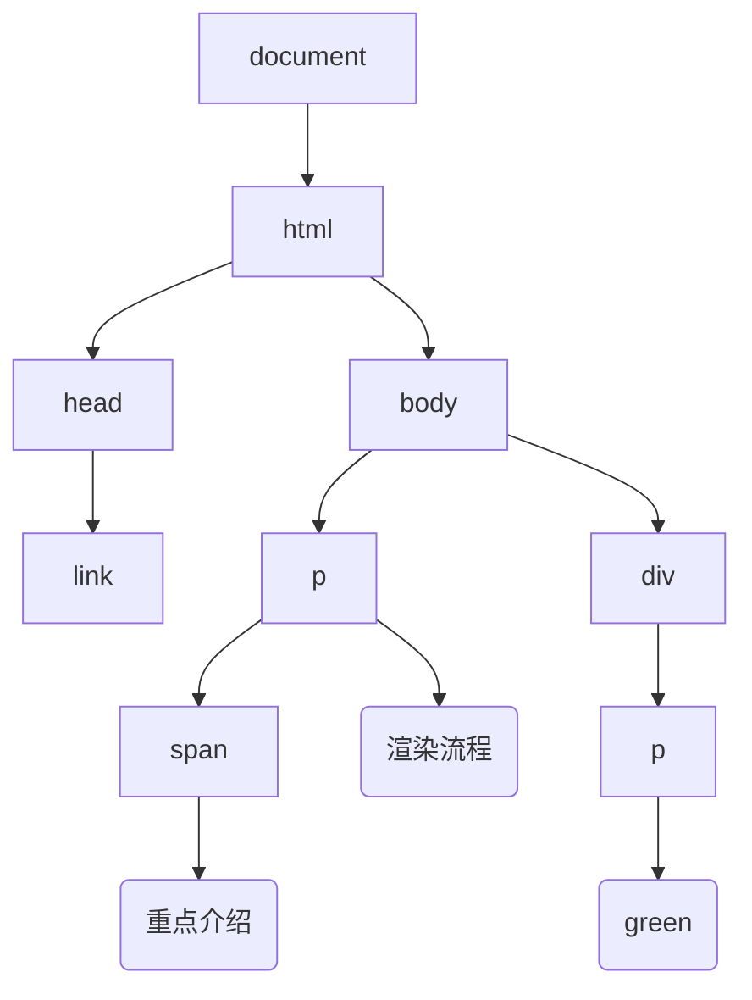

按照渲染的时间顺序，流水线可分为如下几个阶段：
* 构建 DOM 树
* 样式计算
* 布局阶段
* 分层
* 绘制
* 分块
* 光栅化
* 合成。

<!--more-->

1. 将 HTML 转换为浏览器能够理解的结构 —— DOM 树

2.  样式计算（Recalculate Style）
计算出 DOM 节点中每个元素的具体样式，分三步完成：
* 渲染引擎接收到 css 文本时，会执行一个转换操作，将 CSS 文本转换为浏览器可以理解的结构 —— styleSheets。document.styleSheets 可以查看样式 表包含的多种样式。
* 属性值的标准化操作。将属性值 2em/blue/bold 转换为渲染引擎容易理解的、标准化的计算值。
* 根据 css 的继承规则和层叠规则，计算出 Dom 树每个节点的具体样式。css 继承每个 dom 节点都包含父节点样式。

图中，可以看出，样式表的继承关系， user agent styleSheets 是浏览器内置的默认样式
可以在 chrome 开发者工具 ——> 选择 element，再选择 computed 子标签

3. 布局
计算出 DOM 树中可见元素的几何位置，**布局**。额外构建一棵只包含可见元素布局树。

rectangle generateLayoutTree <<生成布局树>> {
  rectangle DOM <<dom>>
  rectangle ComputedStyle <<computed style>>
}
generateLayoutTree -> [body]
note left of [body]
font-size: 20px
end note
[body]-->[p]
note left of [p]
font-size: 20px
color:rgb(0,0,255)
end note
[body]-->[div]
note right of [div]
font-size: 20px
font-weight: 700
color:rgb(255,0,0)
end note
[p]-->渲染流程
[div]-->[div1]
note left of [div1]
font-size: 20px
font-weight: 700
color:rgb(255,0,0)
end note
[div1]-->red

布局树中忽略 head,display:none 的隐藏元素。

**总结：** html 页面内容被提交给渲染引擎，渲染引擎首先将 html 解析为浏览器可以理解的 DOM，接着根据 css 样式表计算出 DOM 树的所有节点的样式；最后计算出元素的几何坐标，将信息保存在 dom 树中。

4. 图层
渲染引擎还需要为特定的节点生成专用的图层，并生成一查对应的图层树（LayerTree），chrome 开发者工具，选择 layer 标签，可查看页面分层情况。
* 拥有层叠上下文的元素会被提升为单独的一层。其中包含明确的定位属性元素，透明和滤境属性。
z-index/position:fixed/filter/opacity
* 需要剪裁（clip）的地方也会被创建为图层 overflow: auto

5. 图层绘制
渲染引擎实现图层绘制，会把一个图层的绘制拆分成很多小的 **绘制指令**，然后再把这些指令按照顺序组成一个待绘制列表，最终输出的是一个绘制列表。
绘制列表用来记录绘制的顺序和绘制指令的列表。
可以打开 chrome 开发者工具 -> Layers 标签 -> Document 查看绘制列表，拖动绘制列表，可以查看绘制过程。如下图：

6. 栅格化（raster）操作
绘制列表用来记录绘制只是用来记录绘制顺序和绘制指令的列表，实际绘制操作由渲染引擎中的合成线程来完成。**合成线程会将图层划分为图块（tile)**
合成线程会将视口（viewport）附近的图块来优先生成位图，实际生成位图的操作由栅格化来执行。栅格化，将图块生成位图。
渲染进程把生成图块的指令发送给GPU，然后在GPU中执行生成图块的位图，并保存在 GPU 内存中。

7. 合成和显示
所有图块都被光栅化后，合成线程会生成一个绘制图块的命令 —— DrawQuad，DrawQuad 命令提交给浏览器进程。
浏览器进程中有一个叫 viz 的组件，用来接收合成线程发过来的 DrawQuad 命令，然后根据 DrawQuad 命令，将其页面绘制到内存中，最后再将内存显示在屏幕上。现在接收到的 html、css、JavaScript 就完美的显示在页面上了。

## 页面渲染

package "网络进程" {
  [response body]
  [response body]--> renderProcess: html/css/javascript
}

package "渲染进程" as renderProcess {
  node "主线程" as mainThread {
    [DOM]
    [Style]
    [Layout]
    [Layer]
    [paint]
  }

  node "合成线程" as synthesisProcess {
    mainThread -> [prepare tiles]: commit
  }

  node "栅格化进程池" as rasterProcesses {
    [raster task1]
    [raster task2]
  }
}

package "GPU 进程" {
  rasterProcesses -> [生成位图]
  [生成位图] -> [生成位图保存在 GPU 内存中]
}

package "浏览器进程" as browserProcess {
  synthesisProcess -> [viz]: DrawQuad
}

browserProcess -> display



## 重排、重绘、合成
### 重排 —— 更新元素的几何属性
通过 JavaScript 或者 CSS 修改元素的几何位置属性（改变宽高）那么浏览器会触发重新布局并解析之后的几个子阶段，这个过程叫 **重排**，`重排需要更新完整的渲染流水线，开销也是最大的`
### 重绘 —— 更新元素的绘制属性
像修改 background 等属性，未改变元素的几何属性，不会触发布局阶段，直接进入绘制阶段，执行之后的子阶段，这个过程叫 **重绘**，`省去了布局和分层阶段，比重排执行效率高`

减少重排重绘, 方法很多：
1. 使用 class 操作样式，而不是频繁操作 style
2. 避免使用 table 布局
3. 批量dom 操作，例如 createDocumentFragment，或者使用框架，例如 React
4. Debounce window resize 事件
5. 对 dom 属性的读写要分离
6. will-change: transform 做优化
