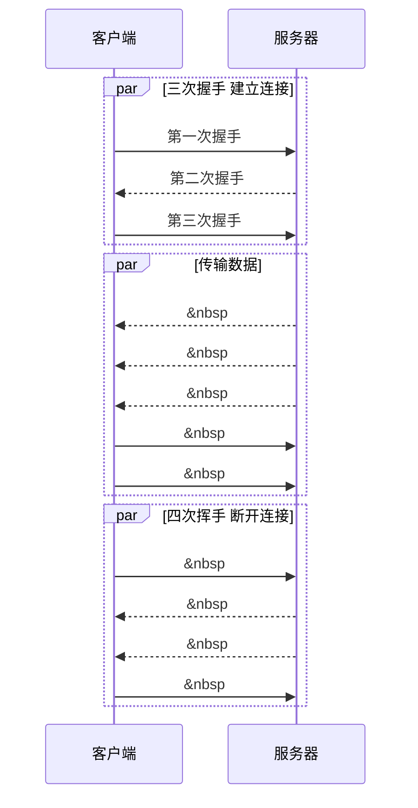

## 概念
> * FP (First Paint) 页面从加载到首次绘制的时长，是衡量 Web 页面性能的重要指标，网络加载速度会影响到 FP 指标。
> * 互联网是一套理念和协议组成的体系架构

**网络的加载速度** 是影响 FP 的重要因素；FP 标志了用户的跳出率，pv，参与度，用户转换率。
**优化网络加载速度**，要充分了解网络，理解网络的关键是网络协议。互联网网络协议 HTTP、WebSocket 都是基于 TCP/IP 的。

那么问题来了：
1. web 世界中，TCP/IP 是如何工作的呢？
2. 在网络中，一个文件通常被拆分成很多数据包传输，如何保证页面文件能被完整的送达浏览器？

## 数据包与数据的传输
### 数据包如何送达主机
互联网中数据是通过数据包传递。如果数据量很大时会拆成很多小的数据包传输。
IP 把数据包送达目标主机，**数据包在互联网上进行传输需要符合网络协议（Internet Protocol, IP）标准。**计算机的地址就称为 IP 地址，访问任何网站实际上只是你的计算机向另外一台计算机请求信息。

@startuml
protocol IP数据包 {
 #数据包
 -IP版本
 +源 IP 地址
 +目的 IP 地址
 -生存时间
}

### 主机如何将数据包转交给应用
### 数据包是如何被完整地送达应用程序

> 计算机地址称为 IP 地址，访问任何网站实际上只是你的计算机向另一台计算机请求信息


rectangle "上层" as upLayer #fff;line.dashed; {
  card 主机A as hostA {
    card 应用 as addressA #aliceblue;line.dotted;line:blue
  }
  card 主机B as hostB {
    card 应用 as addressB #aliceblue;line.dotted;line:blue
  }

  hostA .[#transparent].> hostB
}
rectangle "网络层" as networkLayer #fff;line.dashed; {
  card 主机A as networkLayerHostA {
    card 极客时间IPA #aliceblue;line.dotted;line:blue [
      数据部分
      ---
      附加IP头
    ]
  }
  card 主机B as networkLayerHostB {
    card 极客时间IPB #aliceblue;line.dotted;line:blue [
      数据部分
      ---
      IP 头解析识别出数据部分
    ]
  }

  networkLayerHostA -[#transparent]-> networkLayerHostB
  hostA ..> networkLayerHostA #text:red;line:green;: 数据包交给网络层
  networkLayerHostB ..> hostB #text:red;line:green;: 解开数据包交给上层
}

rectangle "底层" as downLayer #fff;line:transparent
networkLayerHostA ..> downLayer #line:green;
downLayer ..> networkLayerHostB #line:green;

upLayer ..[#transparent] networkLayer
networkLayer ..[#transparent] downLayer



**上图解析**
1.  上层将数据包交给网络层；
2.  网络层将 ip 头附加到数据包上，组成新的 IP数据包，交给底层；
3.  底层通过物理网络将数据包传给主机b;
4.  数据包被传输到主机 b 的网络层，主机 b 拆开数据包的 ip 头信息，并将拆开来的数据部分交给上层；
5.  最终，数据包到达主机 b 的上层

### 2-1-2.  主机如何将数据转交给应用 —— UDP（User Datagram Protocol) 把数据包送达应用程序
IP 只负责把数据包传送到对方电脑
UDP 是基于IP之上与应用程序打交道的协议
UDP 的重要信息是**端口号**，端口号是数字，每个想访问网络的程序都需要绑定一个端口号。
> IP 通过 IP 地址把数据包发送给指定的电脑，而 UDP 通过端口号把数据包分发给正确的程序


rectangle "上层" as upLayer #fff;line.dashed; {
  card 主机A as hostA {
    card 应用 as addressA #aliceblue;line.dotted;line:blue
  }
  card 主机B as hostB {
    card 应用 as addressB #aliceblue;line.dotted;line:blue
  }

  hostA .[#transparent].> hostB
}
rectangle "传输层" as transportLayer #fff;line.dashed; {
  card 主机A as hostAUDP {
    card userDatagramProtocol #aliceblue;line.dotted;line:blue [
      数据
      ---
      UDP 头
    ]
  }
  card 主机B as hostBUDP {
    card userDatagramProtocolB #aliceblue;line.dotted;line:blue [
      数据
      ---
      UDP 头 —— 解开 UDP 头，识别出数据交给上层应用
    ]
  }

  hostA ..> hostAUDP #green
  hostBUDP ..>hostB #green
}
rectangle "网络层" as networkLayer #fff;line.dashed; {
  card 主机A as networkLayerHostA {
    card IPA #aliceblue;line.dotted;line:blue [
      数据部分
      ---
      UDP 头
      ---
      IP头
    ]
  }
  card 主机B as networkLayerHostB {
    card IPB #aliceblue;line.dotted;line:blue [
      数据部分
      ---
      UDP头
      ---
      IP 头解析识别出数据部分
    ]
  }

  networkLayerHostA -[#transparent]-> networkLayerHostB
  hostAUDP ..> networkLayerHostA #text:red;line:green;: 数据包和udp交给网络层
  networkLayerHostB ..> hostBUDP #text:red;line:green;: 解开数据包交给传输层
}

rectangle "底层" as downLayer #fff;line:transparent
networkLayerHostA ..> downLayer #line:green;
downLayer ..> networkLayerHostB #line:green;

upLayer ..[#transparent] transportLayer
transportLayer ..[#transparent] networkLayer
networkLayer ..[#transparent] downLayer



为支持 UDP 协议，把前面的三层协议扩充为四层，在网络层与上层之间加了传输层，上面的具体分析如下：
* 上层将应用的数据包交给传输层
* 传输层在数据包前加UDP头，组成 UDP 数据包，再将 UDP 数据包传输给网络层
* 网络层再将 IP 头附加到 UDP 数据包，组成新的 IP 数据包，并交给底层
* 底层将 IP 数据包交给 主机B 的网络层
* 主机B 网络层，拆开 IP 头，将 UDP 数据包交给传输层
* 传输层将 UDP 头拆开，**并根据 UDP 中所提供的端口号，把数据交给上层应用程序
* 上层应用中主机B，拿到相应的数据包

> UDP 发送数据不可靠，有各种因素会导致数据包出错，对于错误的数据包，不提供重发机制，发送后无法知道是是否到达目的地。但其传输速度非常快。多在在线视频、互动游戏中使用

### 2-1-3.  使用 TCP 将数据完整的传达给应用
UDP 存在两个问题：
1.  传输过程中容易丢包；
2.  大文件拆分成多个小文件传输，这些文件会经过不同的路由器，在不同的时间送达接收端。UDP 不知道如何组装这些数据包，把这些数据包还原成完整的文件。

> TCP(Transmission Control Protocol,传输控制协议)。面向链接、可靠、基于字节流的传输层通信协议。

TCP 的优点在于：
1.  对于丢包的情况会提供重传机制；
2.  TCP 引入数据包排序机制，保证乱序数据包组合成一个完整的文件。

TCP 头除了包含目标端口号和本机端口号，还提供了用于排序的序列号，以便接收端通过序号来重排数据包


rectangle "上层" as upLayer #fff;line.dashed; {
  card 主机A as hostA {
    card 应用 as addressA #aliceblue;line.dotted;line:blue
  }
  card 主机B as hostB {
    card 应用 as addressB #aliceblue;line.dotted;line:blue
  }

  hostA .[#transparent].> hostB
}
rectangle "传输层" as transportLayer #fff;line.dashed; {
  card 主机A as hostATCP {
    card transmissionControlProtocol #aliceblue;line.dotted;line:blue [
      数据
      ---
      TCP 头
    ]
  }
  card 主机B as hostBTCP {
    card transmissionControlProtocolB #aliceblue;line.dotted;line:blue [
      数据
      ---
      TCP 头 —— 解开 TCP 头，识别出数据交给上层应用
    ]
  }

  hostA ..> hostATCP #green
  hostBTCP ..>hostB #green
}
rectangle "网络层" as networkLayer #fff;line.dashed; {
  card 主机A as networkLayerHostA {
    card IPA #aliceblue;line.dotted;line:blue [
      数据部分
      ---
      TCP 头
      ---
      IP头
    ]
  }
  card 主机B as networkLayerHostB {
    card IPB #aliceblue;line.dotted;line:blue [
      数据部分
      ---
      TCP头
      ---
      IP 头解析识别出数据部分
    ]
  }

  networkLayerHostA -[#transparent]-> networkLayerHostB
  hostATCP ..> networkLayerHostA #text:red;line:green;: 数据包和TCP交给网络层
  networkLayerHostB ..> hostBTCP #text:red;line:green;: 解开数据包交给传输层
}

rectangle "底层" as downLayer #fff;line:transparent
networkLayerHostA ..> downLayer #line:green;
downLayer ..> networkLayerHostB #line:green;

upLayer ..[#transparent] transportLayer
transportLayer ..[#transparent] networkLayer
networkLayer ..[#transparent] downLayer



## 完整的 TCP 连接过程
**TCP是如何保证重传机制和数据包的排序功能**

TCP 的生命周期包括：`建立连接`、`传输数据`、`断开链接`
* **`建立连接阶段`**：这个阶段是<u>通过“三次握手”</u>来建立客户端和服务器之间的连接。
TCP 提供**面向连接**的通信传输。<u>**面向连接**是指在数据通信开始之前先做好两端之间的准备工作。</u>
所谓三次握手，是指在建立一个 TCP 连接时，客户端和服务器总共要发送三个数据包以确认连接的建立。

* **`传输数据阶段`**：在该阶段，<u>接收端需要对每个数据包进行确认操作</u>，也就是接收端在接收到数据包之后，需要发送确认数据包给发送端。所以当发送端发送了一个数据包之后，在规定时间内没有接收到接收端反馈的确认消息，则判断为数据包丢失，并触发发送端的重发机制。同样，一个大的文件在传输过程中会被拆分成很多小的数据包，这些数据包到达接收端后，<u>接收端会**按照 TCP 头中的序号**为其排序</u>，从而保证组成完整的数据。
* **`断开连接阶段`**：数据传输完毕之后，就要终止连接了，涉及到最后一个阶段“四次挥手”来保证双方都能断开连接。
