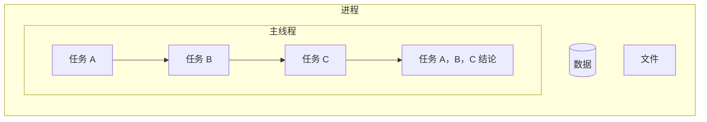
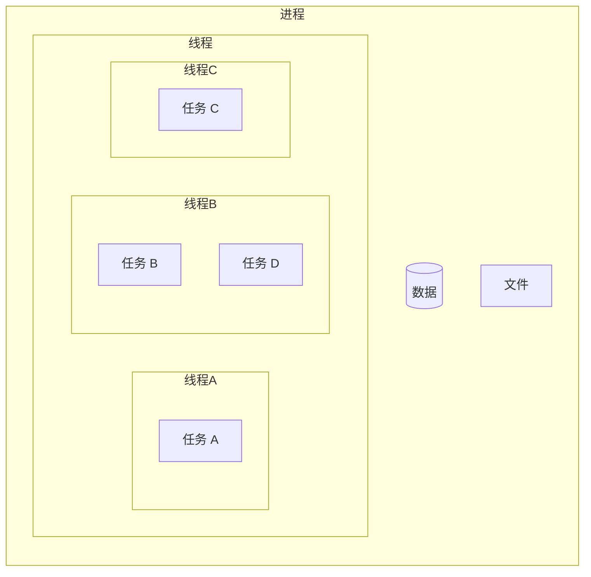

## Chrome 打开一个页面需要启动多少进程
> `启动 Chrome 任务管理器查看` —— chrome 选项 -> more tools -> task manager
> windows 可查看任务管理器

* process id
* cpu
* network
* mermory footprint
* task

**一个 task 对应 一个 process id，可以理解为一个任务启动一个进程**

## 进程
> 是一个程序的运行实例。即启动一个程序时，操作系统为该程序创建一块**内存**。用于存放代码、运行中的数据及一个执行任务的主线程。它是一个**运行环境。**
> * 进程是 CPU 资源分配的最小单位，是拥有资源和独立运行的最小单位


card "进程——运行环境" {
   database data
   file thread
   node code
}
	

`如：有任务 A,B,C,D`
### 并行处理
> 计算机中的并行处理是指同一时刻处理多个任务

## 线程
> * 线程是 CPU 调度的最小单位
### 单线程
> 一个线程是指执行一个任务, A,B,C,D 依次执行

### 多线程
> 同时开启多个线程执行多个任务, 即，三个线程分别执行 A,B,C，再执行 D

## 多进程的浏览器

rectangle " " #fff;line.dashed {
  together {
    collections "**插件进程**\n(Plugin Process)" as pluginProcess #fff;line:blue;line.dashed
    note right of pluginProcess #aliceblue;line.dotted;line:blue;: 负责插件运行，\n保证不会因插件崩溃\n导致浏览器和页面受影响
    collections "**渲染进程**\n(renderProcess)" as renderProcess #fff;line:blue;
    note left of renderProcess #aliceblue;line:blue;line.dotted;: 渲染进程的核心任务\n<b>将 html/css/javascript\n转换为用户可以交互的页面</b>\n排版引擎 Blink 和 JavaScript 引擎 \n V8 都是运行在该进程中
  }

  together {
    card networkProcess #aliceblue;line:blue; [
      **网络进程**
      负责网络资源加载
      之前作为一个模块运行在浏览器进程中
      最近独立出来，作为一个新的进程
    ]
    card BrowserProcess #pink [
      **浏览器主进程**
      主要负责界面显示
      用户交互
      子进程管理
      同时提供存储等功能
    ]

    card GPUProcess #aliceblue;line:blue; [
      **GPU进程**
      GPU 的初衷是实现 3D CSS 效果
      chrome 的 UI 界面采用 GPU 来绘制
    ]
  }

  renderProcess -[#transparent]->networkProcess
}



### 浏览器主进程
> 负责浏览器界面显示，用户交互；
> 负责各页面管理，创建、销毁其它进程
> 将Renderer进程得到的内存中的Bitmap，绘制到用户界面上
> 子进程管理；
> 文件存储等

### 网络进程
> 页面浏览器主进程和渲染进程提交网络资源下载功能

### GPU(Graphics Processing Unit) 进程
> GPU，图形处理器，设计初衷是为了 3D CSS 效果。Chrome 的 UI 界面都选择采用 GPU 来绘制，因 GPU 成为浏览器普遍的需求。最后，Chrome 在其多进程架构上也引入了 GPU 进程。

### 插件进程
> 因插件易崩溃，独立为单独的进程，避免因插件崩溃引起整个浏览器无法运行。插件进程，只有使用插件时才会创建

### utility进程
> 有时候浏览器主进程需要做一些“危险”的事情，比如图片解码、文件解压缩。如果这些“危险”的操作发生了失败，会导致整个主进程发生异常崩溃，这是我们不愿意看到的。因此Chromium设计出了一个utility进程的机制。主进程临时需要做一些不方便的任务的情况下，可以启动一个utility进程来代替主进程执行，主进程与utility进程之间通过IPC消息来通信。

### 渲染进程
> 
