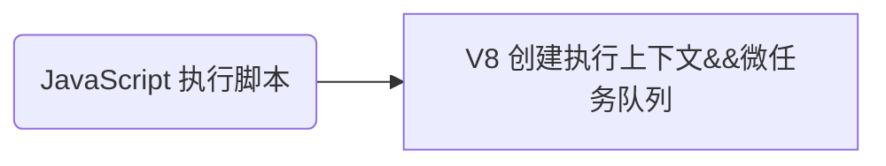
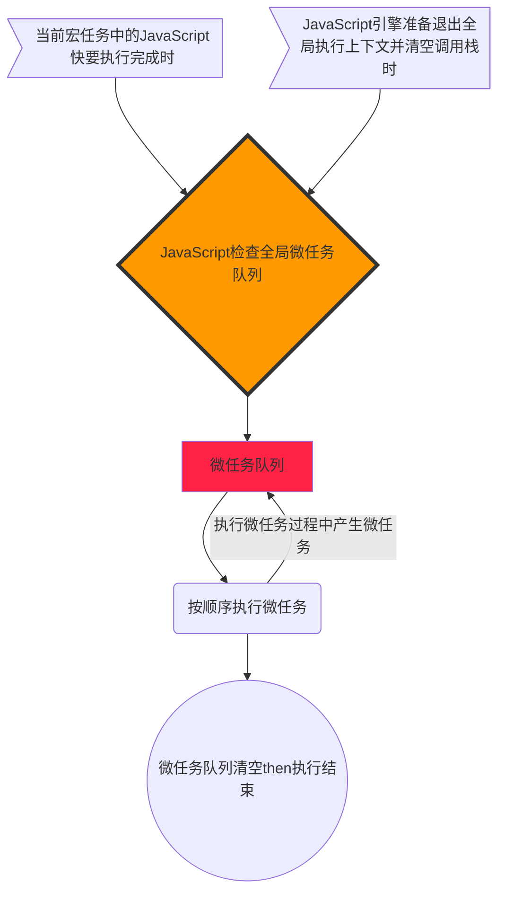
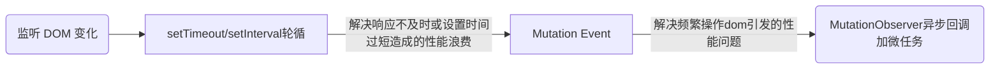

* 宏任务如同开会分配工作，微任务是工作过程中加入临时任务
* **微任务——*实时性和效率之间一个有效的权衡***
* **基于微任务的技术**有<u>MutationObserver、 Promise 以及以 Promise 为基础开发出来的其它技术</u>

## 宏任务
|主线程上的任务|
|---|
|渲染事件（如解析 DOM、计算布局、绘制）|
|用户交互事件（如鼠标、滚动、放大缩小等）|
|JavaScript 脚本执行|
|网络请求|
|文件读写|

> **消息队列**和**事件循环机制**协调主线程上的任务执行，渲染进程内部会***维护*多个消息队列(如延迟队列、普通消息队列等。)**。 这些消息队列中的任务称为**宏任务**。

消息队列中的任务是通过事件循环执行的，以下是 WHATWG 规范中对于事件循环机制的定义：

```mermaid
graph TD
step1(从多消息队列中选出'oldestTask') --> step2[事件循环系统记录任务开始时间]
step2 --> step3[设置'oldestTask'为当前执行任务]
step3 --> step4[任务完成后&#44;删除当前执行任务]
step4 --> step5[消息队列中删除'oldestTask']
step5 --> step6(统计执行完成的时长)
```


### 宏任务无法处理对时间精度要求较高的任务
页面的渲染事件、各种 IO 的完成事件、执行 JavaScript 脚本的事件、用户交互的事件等，都随时有可能被添加到消息队列中。而且添加事件是由系统操作的，JavaScript 
代码不能准确掌控任务要添加到队列中的位置，不能控制任务在队列中的位置，也就不能掌握任务开始的时间。
```html
<!DOCTYPE html>
<html>
  <body>
    <div id='demo'>
      <ol>
        <li>test</li>
      </ol>
    </div>
  </body>

  <script type="text/javaScript">
    function timerCallback2() {
      console.log(2)
    }
    function timerCallback1() {
      console.log(1)
      setTimeout(timerCallback2, 0)
    }
    setTimeout(timerCallback1, 0)
  </script>
</html>
```

setTimeout 函数触发的回调函数都是宏任务。
图中渲染引擎将一些系统级任务（图中粉色区域）插入到了两个定时任务中间。如果中间系统级任务处理时间过长，会影响后面一个定时任务执行。<font color="#f33">**宏任务时间粒度大，执行时间间隔是不能精确控制的，对一些高实时性的需求不符合。**</font>setTimeout 和 XMLHttpRequest 的回调被添加在宏任务中。

## 微任务
<font color="#f99">`异步回调的两种方式`</font>：
1.  把回调函数封装成一个宏任务，添加到消息队列尾部，当循环系统执行到该任务的时候执行回调函数
2.  第二种方式的执行时机是<u>主函数执行结束之后、当前宏任务结束之前</u>执行回调函数，通常是以微任务形式体现

> **微任务**就是一个需要异步执行的函数，执行时机是在主函数执行结束之后、当前宏任务结束之前

### 从 v8 引擎层面分析微任务运转

<font color="#f33">V8 创建的微任务队列只在 v8 引擎内部使用，无法通过 JavaScript 访问。<u>每个宏任务都关联一个微任务队列</u></font>

### 微任务产生的方式
现代浏览器中产生微任务有两种方式：
*  **使用 MutationObserver 监控 DOM 节点，通过 JavaScript 来修改节点（或添加删除），当 DOM 节点发生变化时，就会产生 DOM 变化记录的微任务**
*  **使用 Promise，当调用 Promise.resolve() 或 Promise.reject() 产生微任务**

### 微任务队列是何时被执行的时机
**<div style="text-align: center;color: #f33">一个宏任务对应的微任务的执行流程</div>**


>WHATWG 把执行微任务的时间点称为**检查点**

如果在执行微任务的过程中，产生新微任务，同样会将该微任务添加到微任务队列中。V8 引擎一直循环执行微任务队列中的任务，直到队列为空。也就是说在执行微任务的过程中产生的新的微任务并不会推迟到下个宏任务中执行，而是在当前的宏任务中继续执行。

**<div style="text-align: center;color: #f33">微任务示意图</div>**

skinparam componentStyle rectangle
card 宏任务 {
  component parseHTML #66F
  component EvaluateScript #66f
  component 执行上下文 {
    component 微任务队列 #fee {
      component Mutation #f66
      component Promise #f66
      component "Promise.resolve(1)" as resolve #66F
      component removeChild #66f
    }
  }
}


---


skinparam componentStyle rectangle
card 宏任务 {
  component parseHTML #66F
  component EvaluateScript #66f
  component 执行上下文 {
    component 微任务队列 #fee {
      component Mutation #f66
    }
  }
  component "resolve(1)" as resolve #66F
  微任务队列 --> resolve : Promise 取出 Promise 在当前宏任务中执行
}

card 宏任务 as task1 {
  component parseHTML as parseHTML1 #66F
  component EvaluateScript as EvaluateScript1 #66f
  component 执行上下文 as 执行上下文1 {
    component 微任务队列 as 微任务队列1 #fee {
    }
  }
  component "resolve(1)" as resolve1 #66F
  微任务队列1 --> resolve1 : Mutation 取出 Mutation 在当前宏任务中执行
}


---

```mermaid
graph TD
start(执行 parseHTML 宏任务) --> step1[JavaScript 脚本]
step1[暂停parseHTML进入JavaScript执行环境] --> step2[创建微任务Promise/removeChild]
step2 --> step3[添加Promise/removeChild到微任务列表]
step3 --> step4[JavaScript 执行结束&#44;准备退出全局执行上下文&#44;进入检查点]
step4 --> step5[JavaScript 引擎检查微任务列表&#44;发现列表中有微任务&#44;依次执行微任务]
step5 --> over(任务队列清空后&nbsp;退出全局执行上下文)
```

关于微任务、宏任务的几点结论：
1.  微任务和宏任务绑定，每个宏任务执行都会创建自己的微任务队列
2.  微任务的执行时长影响到当前宏任务的执行时长。如一个宏任务产生了 100 个微任务，每个微任务执行时长 10 毫秒，那么宏任务被延长了 1秒钟。写代码时要注意控制微任务时长
3.  在一个宏任务中，分别创建了用于回调的宏任务和微任务，无论什么情况，微任务都早于宏任务执行

### 微任务是如何应用在 MutationObserver 中的
> MutationObserver 是用来监听 DOM 变化的一套方法（web 应用需要监听 DOM 变化并及时地做出响应）

Web 应用使用 HTML+JavaScript 构建自定义控件，为了能让这些非固有控件与**内置固有控件**一起良好工作，<u>自定义控件必须能够适应内容更改、响应事件、用户交互</u>，**Web 应用要监控 DOM 变化，并及时作出响应**

#### 早期监控 DOM 变化
早期不提供对监听的支持，要观察 DOM 是否变化，**唯一能做的就是轮询检测**，如使用 setTimeout 或者 setInterval 定时检测 DOM 是否变化。

<font color="#f33">两个问题：</font>
1. 如果时间间隔设置过长，DOM 变化响应不够及时
2. 如果时间间隔设置过短，会浪费无用的工作量检查 DOM，让页面变得低效

#### 2000 年引入 Mutation Event
> **Mutation Event** 采用了 **观察者设置模式** 
> 当DOM 有变化时就立即触发相应的事件，**这种方式属于同步回调**

<font color="#f99">Mutation Event 解决了实时性的问题</font>，DOM 一旦发生变化，立即调用 javaScript 接口。
<font color="#f33">这种实时性造成了严重的性能问题，每次 DOM 变化，渲染引擎会调用 javaScript 会产生较大的性能开销。</font>比如利用 javaScript 动态创建 50 个节点，会触发 50 次回调，若每次回调执行时 2ms，500 次是 1000ms ，如果是一个动画执行，Mutation Event 触发回调会导致动画卡顿

#### DOM4开始用 MutationObserver 替代 Mutation Event
> MutationObserver API 用来监视 DOM 变化，包括其属性变化、节点增减、内容变化等

**<div style="text-align: center;color: #f33">Mutation Event 与 Mutation Observer</div>**

|差异点|Mutation Event|Mutation Observer|
|--|--|--|
|响应函数|同步调用，每次 DOM 变化后触发调用|异步调用，多次 DOM 调用后，**一次触发调用**<br/>使用数据结构记录所有 DOM 变化，解决频繁操纵DOM造成的影响|

> MutationObserver 采用 异步+微任务 解决性能与实时性的问题
  异步减少调用次数缓解性能问题，实时性的问题则交给微任务，在每次 DOM 节点发生变化时，渲染引擎将变化记录封装成微任务，并将微任务添加到队列中。当执行到检查点时，V8 引擎会按照顺序执行微任务

#### 总结
