## 页面事件循环系统
了解页面到底是如何运行的
了解浏览器的主线程是如何动作的

## 线程模型（一）—— 主线程依照代码顺序，依次执行任务
用单线程是<font color="#f99">**按顺序，依次**</font>处理确定好的任务
```javaScript
var a = 1 + 2; // task1
var b = 2 + 3; // task2
var c = 3 + 4; // task3

console.log(a, b, c) // task4
```

title 线程
hide footbox

skinparam participant {
    borderColor blue
    borderStyle dotted
    fontColor blue
    backgroundColor aliceblue
}

skinparam boundary {
    borderColor #633
    backgroundColor #933
}

entity 开始线程 as start
participant task1
participant task2
participant task3
participant task4
boundary 线程退出 as end
start-->task1
task1-->task2
task2-->task3
task3-->task4
task4-->end



## 线程模型（二）—— 事件循环机制处理线程执行过程中接收的新任务
线程运行过程中加入新的任务 
引入 **循环语句** 和 **事件系统**，在线程执行过程中接收并处理新任务。
> 采用**事件循环机制**，在线程运行过程中接收并执行新任务
```c++
// main thead
void MainThread() {
  // for 循环机制
  for(;;) {
    int first_num = GetInput()
    int second_num = GetInput()
    result_num = first_num + second_num
    print('result:' + result_num)
  }
}
// GetInput 获取用户输入，并返回
int GetInput() {
  int input_number = 0;
  cout<<"请输入一个数：";
  cin>>input_number;
  return input_number
}
```
1.  主线程中 **引入循环机制**，即在线程语句加入 for 循环，线程会一直循环执行；
2.  **引入事件**,如在线程运行过程中，等待用户输入，线程暂停，接收到用户输入后，线程激活，继续执行。


card 线程模型采用事件机制，接收并执行新任务 {
control "for(;;)" as control
note right of control: 接收任务并继续执行
boundary "主线程" as startEnd
note left of startEnd: 初始化线程

startEnd <-[thickness=4]- control
control <-[thickness=4]- startEnd
}


## 线程模型（三）—— 消息队列管理 IO 线程传递的新任务，循环机制从消息队列中取任务执行

title 渲染进程
card 主线程 as mainThread

card IO线程 as IOThread {
  0 ..>mainThread: 资源加载完成事件
  1 ..>mainThread: 鼠标点击事件
  2 ..>mainThread: 其它事件
}



> 引入 **消息队列** 接收其它线程发送过来的任务。
  <font color="#f33">使用消息队列管理IO线程传递的任务</font>，<u>队列先进行出，任务添加在队列尾部，从头部取出</u>

消息队列是一种数据结构，可以存放要执行的任务。特点**先进先出**，添加到尾部，从头部取出


title 渲染进程
skinparam component {
  backgroundColor #599989
}
skinparam rectangle {
  backgroundColor #339945
}

rectangle "主线程" {
  left to right direction
  boundary 线程 as startEnd
  control "for(;;)执行任务" as control
  control == startEnd
}

component 消息队列 {
   component 任务2 {
}
   component 任务1 {
}
   component 任务N
   [任务...]
}

任务1 --> control

card IO线程 as IOThread {
  0 ..>任务N: 资源加载完成事件
  1 ..>任务N: 鼠标点击事件
  2 ..>任务N: 其它事件
}


```c
// 构造队列
class TaskQueue {
    pulic:
    Task takeTask() // 取出队列头部的一个任务
    void pushTask(Task task); // 添加一个任务队列的尾部
}

// 主线程从队列中读取任务
TaskQueue task_queue
void ProcessTask();
void MainThred() {
    for(;;) {
        Task task = task_queue.takeTask()
        processTask(task)
    }
}
```

其它线程想要发送任务让主线程执行，只需要将任务添加到消息队列中就可以了。由于多个线程操作同一个消息队列，所以在添加任务和取出任务时还会加一个**同步锁**。

## 线程模型（四）—— 处理其它进程发送过来的任务
如果其它线程想要发送任务给页面主线程，那么需要先通过 IPC 把任务发送给渲染进程的 IO 线程，IO 线程再把任务发送给页面主线程。

skinparam component {
  backgroundColor #599989
}
skinparam rectangle {
  backgroundColor #339945
}

card 渲染进程 {
    rectangle "主线程" {
        left to right direction
        boundary 线程 as startEnd
        control "for(;;)执行任务" as control
        control == startEnd
    }

    component 消息队列 {
        component 任务2 {
        }
        component 任务1 {
        }
        component 任务N
        [任务...]
    }
        
        任务1 --> control
        
    card IO线程 as IOThread {
        0 ..>任务N: 资源加载完成事件
        1 ..>任务N: 鼠标点击事件
        2 ..>任务N: 其它事件
    }
}

[网络进程]
[浏览器进程]

网络进程 --> IOThread: IPC 资源加载完成
浏览器进程 --> IOThread: IPC 鼠标点击


> 渲染进程专门有一个IO线程用来接收其它线程传进来的消息，IO线程会将这些消息组装成任务发送给渲染主线程

## 消息队列中的任务类型
### 事件类型
|内部消息类型|
|----|
|输入事件（鼠标事件）|
|微任务|
|文件读写|
|WebSocket|
|javaScript定时器|

|页面相关的事件|
|----|
|javaScript 执行|
|解析 DOM|
|样式计算|
|布局计算|
|css 动画|

<font color="#f33">以上事件是在主线程中执行的，所以在编写 web 应用程序时，需要衡量这些事件所占用的时长、并解决单个任务占用主线程过久的问题。</font>

## 主线程如何安全退出
> chrome 确定退出当前页面时，页面主线程会**设置一个退出标志的变量**，在每次**执行完一个任务时，判断是否设置退出标志**。如果有，直接中断所有任务，退出线程。

```c
TaskQueue task_queue
void ProcessTask()
bool keep_running = true
void MainThread() {
    for(;;) {
        Task task = task_queue.taskTask()
        ProcessTask(task)
        if(!keep_running) break; // 设置退出标志后，直接退出线程循环
    }
}
```

## 页面中使用单线程的缺点——微任务解决效率和实时性问题
### 如何处理高优先级的任务
<font color="#f99">场景：</font>在处理监听 DOM 节点变化（即 DOM 插入、修改、删除等），根据这些变化处理相应的业务逻辑的场景。<br/>
<font color="#f99">处理方式：</font>通常是采用**观察者模式**——利用 javaScript 
设计**监听接口**，当变化发生时，渲染引擎同步调用这些接口。<br/>
<font color="#f99">问题：</font><u>DOM 变化非常频繁，每次变化都调用直接调用相应 javaScript 接口，那么**当前任务执行时间拉长，导致执行效率下降。**如果将 DOM 
变化做成异步消息事件，添加到消息队列尾部，又会**影响到监控的实时性**。</u>

> <font color="#f99">解决方式：</font><font color="#f33">微任务用来权衡实时性与效率，微任务如何权衡效率与实时性的</font>
  消息队列中的任务称为宏任务，每个宏任务中都包含一个微任务队列。

在执行宏任务中，DOM 有变化，那么就会将变化添加到微任务列表中，这样就不会影响到宏任务的执行。解决了执行效率问题。
当前宏任务执行完成，执行当前宏任务的微任务（DOM 变化的事件都保存在微任务列表中），从而解决了实时性的问题。

### 如何解决单个任务执行过久的问题


title 线程
hide footbox

skinparam participant {
borderColor blue
borderStyle dotted
fontColor blue
backgroundColor aliceblue
}

skinparam boundary {
borderColor #633
backgroundColor #933
}

entity 主线程开始 as start
participant style
participant layout
participant JavaScript #f33
participant paint
boundary 主线程退出 as end
start-->style
style-->layout
layout-->JavaScript
note right #f33: JavaScript 执行时间过长，造成页面卡顿，影响后面的任务
JavaScript-->paint
paint-->end


> javaScript 通过回调功能解决单个任务执行过久，造成后面任务等待时间太长，给用户卡顿的感觉。<font color="#f33">JavaScript 可以通过回调功能来规避，也就是让要执行 JavaScript 
> 任务滞后执行。</font>

## 浏览器如何运行的
开发者工具 --> performance 标签 --> 右上角 start profiling and load page

我们点击展开了 Main 这个项目，其记录了主线程执行过程中的所有任务。图中灰色的就是一个个任务，每个任务下面还有子任务，其中的 Parse HTML 任务，是把 HTML 解析为 DOM 的任务。值得注意的是，在执行 Parse HTML 的时候，如果遇到 JavaScript 脚本，那么会暂停当前的 HTML 解析而去执行 JavaScript 脚本。

## 总结

```mermaid
graph TD
module1[主线程按顺序依次执行任务]--> module2[主线程引入循环语句与事件系统&#44;处理执行过程中接收的新任务]
module2 --> module3[主线程与消息队列解决其它线程发送的任务]
module3 --> module4[其它线程通过IPC把任务发送给渲染进程的IO线程&#44IO线程把任务发送给主线程]
module4 --> module5[引入微任务解决效率与实时性问题]
```

