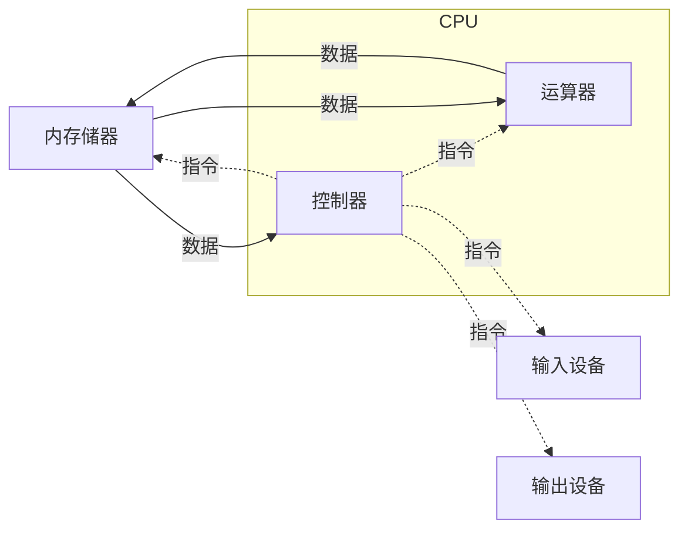

> 加法器 —— 计算机的前身，计算机科学之父 艾伦图灵 和 约翰·冯·诺依曼 

## 冯诺依曼体系结构

冯•诺依曼将计算机分为五个部分：输入设备、存储设备、运算器、控制器、输出设备。

## 计算机的组成
> 计算机系统的逻辑结构实现。包括计算机内**数据信号**和**控制信号**的流向及逻辑设计。

## 电脑硬件
> 计算机所有物理部件集合。
```mermaid
 mindmap
  root((计算机硬件系统))
    外部设备
      输入设备</br>外设</br>Input Devices
	  	键盘
		鼠标
		手写板
		触摸屏
		扫描仪
      输出设备</br>Output Devices
        显示器
		打印机
		绘图仪
    存储器
      内存
	  	只读存储器<br/>Read Only Memory, ROM
		随机存储器<br/>Random Access Memory, RAM
      外存<br/>长期存储程序和数据
        软盘
		硬盘<br/>硬质圆形磁表面存储媒体，存储量大，存储速度快
		光盘
		U盘
	中央处理器<br/>Central Processing Unit
		运算器<br/>Arithmetic Unit
		控制器<br/>Controller
```
**输入设备的作用**是将程序、原始数据、文字、字符、控制命令或现场采集的数据等信息输入计算机。
输出设备是用来输出 计算机的中间结果或最后结果、各种数据符号及文字或各种控制信号等信息。
### ROM 与 RAM 的区别
|类别|对信息的修改|断电后的信息情况|用途|
|--|--|--|--|
|ROM|只读|不丢失|永久存储特殊专用信息|
|RAM|可读、可写|全部丢失|存储临时的程序和数据|

### 必要硬件 
	电脑亮机必不可少的硬件: CPU, 主板、内存、电源、显卡
> 电脑亮机，即显示器有视频输出
### 重要硬件
	CPU 散热器，硬盘
> 电脑正常使用的所需要的硬件
	
<font color="#a33">**CPU、显卡、内存、硬盘决定着电脑的性能，主板、电源、散热器是对性能最基本的保障**</font>
### 常用硬件
> 采集卡、独立网卡、独立声卡是对电脑功能的扩展或者强化

### Central Processing Unit(CPU)
中央处理器，是一台电脑的核心。主要负责信息计算处理，在一定范围上控制并管理其他硬件
运算器
控制器

### 个人电脑
12-inch 12 英寸
fourt Thanderbolt 3 ports 四个霹雳3端口

## 计算机软件
软件是**程序**、**数据**、**文档**的集合。
```mermaid
mindmap
 root((计算机软件))
  系统软件
	操作系统<br/>OS
	 windows
	 Linux
	 MacOS
	**各种编译解释软件**<br/>将人类可读、可理解的源代码文本转换为计算机运行的机器指令格式。
	数据库系统
	 关系型数据库
		MySQL
		SQL Server
		Oracle
	 非关系型数据库
		Mongodb
  应用软件
```
