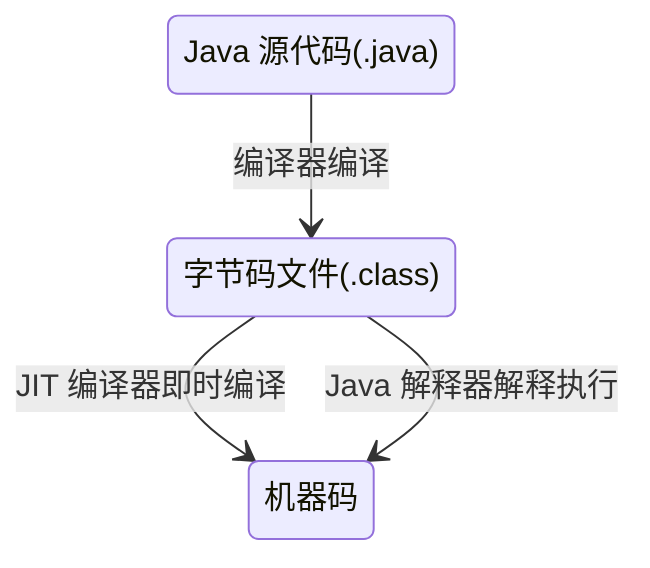

## 编译型语言
编译型语言是指首先将编写的代码编译成可执行文件。如 windows 系统上，首先要编译成 .exe 文件。

## 解释型语言
相对于编译型语言，解释型语言 不需要编译，程序在运行时才编译成机器语言解释一条执行一条，边解释边执行。效率低。

> 解释型语言是为了解决编译型语言跨平台的不足

### 解释型语言 Java
Java 程序的跨平台是因 Java 虚拟机跨平台 

## 解释型语言与编译型语言对比
|类型|原理|优点|缺点|
|--|--|--|--|
|编译型语言|通过专门的编译器，将高级语言一次性编译成可被平台执行的机器语言|编译一次后，脱离开发环境可独立运行，效率高|对编译器依赖较大，可移植性差|
|解释型语言|由专门的解释器，将原程序解释成特定的平台可执行的指令|跨平台性好，通过不同的解释器，将其解释成某平台可识别的指令即可|编译和解释一起执行，效率低|