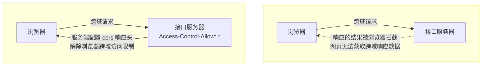
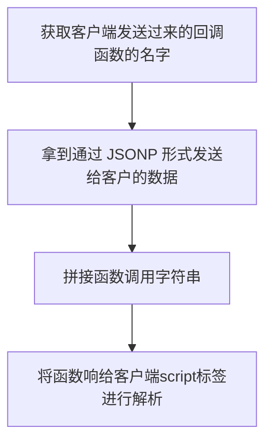

> 违背同源策略的就是 **跨域**，可以说**跨域** 是浏览器同源策略的产生。

## [浏览器的同源策略(Same-Origin Policy)](https://developer.mozilla.org/zh-CN/docs/Web/Security/Same-origin_policy)
> 最早是由 Netscape（网景）公司提出，是浏览器的一种安全策略。

<u><span class='custom-box custom-box-933'>同源，相同的协议 + 相同的域名 + 相同的端口号</span>`同源`策略是一种隔离恶意文件的安全机制。</u>
<span class='custom-box custom-box-939'>对不同源之间的文档或脚本交互进行了限制。</span>
<span class='custom-box custom-box-393'>**不同源**是指两个页面的协议、端口、域名有一个不同</span>

与`https://developer.mozilla.org/zh-CN/docs/Web/Security/Same-origin_policy`对比是否同源

|序号| link | 协议 | 域名 | 端口 | 是否同源 | 原因 |
|:---:|------|-----|------|-----|---------|-----|
|1|https://developer.mozilla.org/en-US/docs/Web/Security/Same-origin_policy|https|developer.mozilla.org|80|是|路径不是同源的限制条件|
|2|http://developer.mozilla.org/zh-CN/docs/Web/Security/Same-origin_policy|http|developer.mozilla.org|80|否|协议不同|
|3|https://develop.mozilla.org/zh-CN/docs/Web/Security/Same-origin_policy|https|develop.mozilla.org|80|否|域名不同|
|4|https://developer.mozilla.org:81/index.html|https|developer.mozilla.org|81|否\是|端口不同（IE 中端口号不在同源策略中，固在IE 浏览器中，属同源）|
|5|https://new.developer.mozilla.org:81/index.html|https|new.developer.mozilla.org|80|否|域名 new.developer.mozilla.org 不同|


### IE 是否同源略有差异
> - [x] 在 IE 中，两个高度互信的域名不用遵守同源策略限制。`授信范围（Trust Zones）`
> - [ ] <span class='custom-box custom-box-933'>在 IE 中，`端口`号不在同源策略中，即**协议、域名相同则不受同源策略限制**</span>

```JavaScript
document.domain = "company.com"; // 修改当前域名
```

## 跨域解决方案
### document.domain + iframe
`共享数据的两个页面域名有共同的主域名或b域名是a域名的子域名`
> 上表 4、5 中，主域名相同，均为 'mozilla.org'
  https://developer.mozilla.org:81/index.html 中
  ```html
  <iframe src="https://new.developer.mozilla.org:81/index.html"></iframe>
  <script>
    document.domain = 'mozilla.org';
    var user = 'HelenZhanglp';
  </script>
  ```
> https://new.developer.mozilla.org:81/index.html
  ```html
  <script>
    document.domain = 'mozilla.org';
  </script>
  ```
> *** 如此，new.developer.mozilla.org 所以访问到 developer.mozilla.org 中的数据 ***

### 跨域解决方案 - jsonp
<span class='custom-box custom-box-339'>在页面中用 about:blank 或 JavaScript: URL 执行的脚本会继承打开该 URL 的文档的源，因为这些类型的 URLs 没有明确包含有关原始服务器的信息。</span>
例如，about:blank 通常作为父脚本写入内容的新的空白弹出窗口的 URL（例如，通过  Window.open()  机制）。 如果此弹出窗口也包含代码，则该代码将继承与创建它的脚本相同的源。

> jsonp 是 json 的使用模式，使用 jsonp 跨域，没有兼容方面问题
`img,iframe,script` 三个标签可以通过 src 属性获取不同源的服务器资源
当使用 jsonp 模式发送请求时 ***需要服务端支持*** 需要用 callback 函数包裹 json 串

##### 以下案例是用 node 启后端服务
```html
// localhost:4000/index.html
<script>
  var fn = function(data){
    console.log(data.name, 'jsonp')
  }
</script>
<script src='http://localhost:8888/?callback=fn'></script>
```
```javascript
// node server.js
let http = require('http')
var urllib = require('url');

http.createServer(function(request, response) {
  response.writeHead(200, {'Content-Type': 'text/plain'})
  var params = urllib.parse(request.url, true)

  if (params.query && params.query.callback) {
    var str =  params.query.callback + '(' + JSON.stringify({
      name: 'HelenZhanglp'
    }) + ')'; //jsonp
    console.log(str)

    response.end(str);
  }
  response.end('localhost:8888')
}).listen(8888)
console.log('Server running at http://127.0.0.1:8888/index.js');
```

以上 Demo 二个注意点：
1. http://localhost:8888/?callback=fn 注意这个链接，参数之前加 `?`。如此，node 服务端可以通过 urllib.parse(request.url, true) 进入参数解析
2. 函数 fn 是以变量赋值方式声明的，这里有个 **[变量提升]()** 的概念，一定要先声明赋值后再引用，如 demo (localhost:4000/index.html)。顺序不能错。
3. 注意：<span class='custom-box custom-box-933'>JSONP只支持GET请求，服务端可能在JSONP响应中夹带恶意代码，判断是否请求成功是困难的。</span>

### [跨域资源共享（CORS）](https://developer.mozilla.org/zh-CN/docs/Web/HTTP/Access_control_CORS)<span class='custom-box custom-box-939'>当前主流解决方案</span>
  1.  [CORS](https://developer.mozilla.org/zh-CN/docs/Glossary/CORS) Cross-Origin Resource Sharing，跨域资源共享）是一个系统，<span class='custom-box custom-box-933'>它由一系列传输的HTTP头组成</span>，这些 <span class='custom-box custom-box-393'>`HTTP头决定浏览器是否阻止前端 JavaScript 代码获取服务器资源`</span>。浏览器同源安全策略 <span class='custom-box custom-box-339'>默认阻止“跨域”获取资源</span>。但是 CORS 给了web服务器这样的权限，<span class='custom-box custom-box-993'>即服务器可以选择，允许跨域请求访问到它们的资源。</span> 那么浏览器的跨域访问限制就被解除了。
  2.  跨域资源共享(CORS) 是一种机制，它使用额外的 HTTP 头来告诉浏览器，让运行在一个 origin (domain) 上的Web应用被准许访问来自不同源服务器上的指定的资源。当一个资源从与该资源本身所在的服务器不同的域、协议或端口请求一个资源时，资源会发起一个跨域 HTTP 请求。比如，站点 http://domain-a.com 的某 HTML 页面通过  的 src 请求 http://domain-b.com/image.jpg。网络上的许多页面都会加载来自不同域的CSS样式表，图像和脚本等资源。
  出于安全原因，浏览器限制从脚本内发起的跨源HTTP请求。例如，XMLHttpRequest 和 Fetch API 遵循同源策略。这意味着使用这些 API的 Web 应用程序只能从加载应用程序的同一个域请求HTTP资源，除非响应报文包含了正确CORS响应头。



#### CORS 跨域资源共享
浏览器的`同源安全策略`默认阻止网页跨域获取资源。<u>但如果接口服务器配置了 CORS 相关的 HTTP 响应头，就可以解除浏览器的跨域访问限制。</u>
* 响应头 Access-Control-Allow-Origin, origin 参数值指定了**允许访问该资源外域的 URL**
```JavaScript
res.setHeader('Access-Control-Allow-Origin', 'http://abc.com') // 或者为 * 允许所有资源访问
```
* 响应头 Access-Control-Allow-Headers
默认情况下，CORS 仅支持客户端向服务器发送如下9个请求头：
Accept,Accept-Language,Content-Language,DPR,Downlink,Save-Data,Viewport-Width,Width,Content-Type(text/plain, multipart/form-data,application/x-www-form-urlencoded 三者之一)
<span class='custom-box custom-box-933'>如果客户端向服务器发送了额外的请求头信息，服务器端需要通过 Access-Control-Allow-Headers 对额外的请求头进行声明，否则请求失败。</span>
```JavaScript
res.setHeader('Access-Control-Allow-Headers', 'custom-header')
```
* 响应头 Access-Control-Allow-Methods
默认情况下，CORS 只支持客户端发起 GET/POST/HEAD 请求。
如果客户端希望通过 PUT、DELETE 等方式请求服务器资源，需要在服务器端，通过 Access-Control-Allow-Methods 指明实际请求所允许使用的 HTTP 方法
```JavaScript
res.setHeader('Access-Control-Allow-Methods', '*')
```

### 预检请求
* 请求方式为 GET/POST/HEAD 之外的请求 Method 类型；
* 请求头中包含自定义头部字段；
* 向服务器发送 application/json 格式的数据

在浏览器与服务器正式通信之前，浏览器会先发送 OPTION 请求进行预检，以获知服务器是否允许该实际请求，这一次的 OPTION 请求称为“预检请求”。服务器成功响应预检请求后，才会发送真正的请求，并且携带真实数据。

### 简单请求与预检请求
<span class='custom-box custom-box-933'>简单请求：客户端与服务器端只会发生一次请求。</span>
<span class='custom-box custom-box-933'>预检请求：客户端与服务器之间会发生两次请求，OPTION 预检请求成功后，会发起真正的请求。</span>

### JSONP 的概念与特点
> 浏览器端通过 `<script>` 标签的 src 属性，请求服务器上的数据，同时，服务器返回一个函数的调用。这种请求方式叫做 JSONP
<span class='custom-box custom-box-339'>特点：</span> JSONP 不是真正的 Ajax 请求，它没有用 XMLHttpRequest
<span class='custom-box custom-box-339'>特点：</span> JSONP 仅支持 GET 请求，不支持 POST,PUT,DELETE 请求


[demo for jsonp](https://github.com/HelenZhangLP/demo/blob/master/node/src/demo13/index.js)

## Error
#### <font color='red'>ERROR —— Access to XMLHttpRequest at 'file://Users/.../jsx/jsx-basic.js' from origin 'null' has been blocked by CORS policy: Cross origin requests are only supported for protocol schemes: http,data,chrome,chrome-extension,chrome-untrusted,https</font>
```html
<!DOCTYPE html>
<html lang="en" dir="ltr">
  <head>
    <meta charset="utf-8">
    <!-- react core code when deploying, replace "development.js" with "production.min.js" -->
    <script src="https://unpkg.com/react@16/umd/react.development.js"></script>
    <!-- react about dom's function -->
    <script src="https://unpkg.com/react-dom@16/umd/react-dom.development.js"></script>
    <!-- Don't use this in production  -->
    <script src="https://unpkg.com/babel-standalone@6.15.0/babel.min.js"></script>
    <title></title>
  </head>
  <body>
    <div id="root"></div>
    <script type="text/babel" src="./import.js"></script>
  </body>
</html>
```
> 解决办法：
http-server 打开一个本地服务，通过本地服务请求
```
Starting up http-server, serving ./
Available on:
  http://127.0.0.1:8080
  http://192.168.5.10:8080
Hit CTRL-C to stop the server
[2021-03-03T04:44:16.576Z]  "GET /jsx/jsx.html" "Mozilla/5.0 (Macintosh; Intel Mac OS X 10_15_7) AppleWebKit/537.36 (KHTML, like Geck
o) Chrome/88.0.4324.192 Safari/537.36"
```
