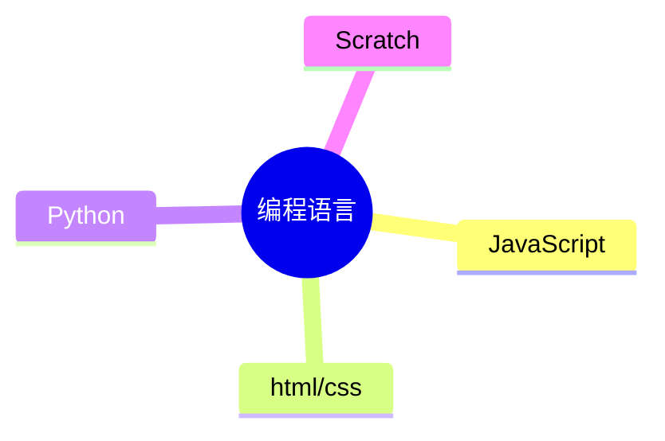
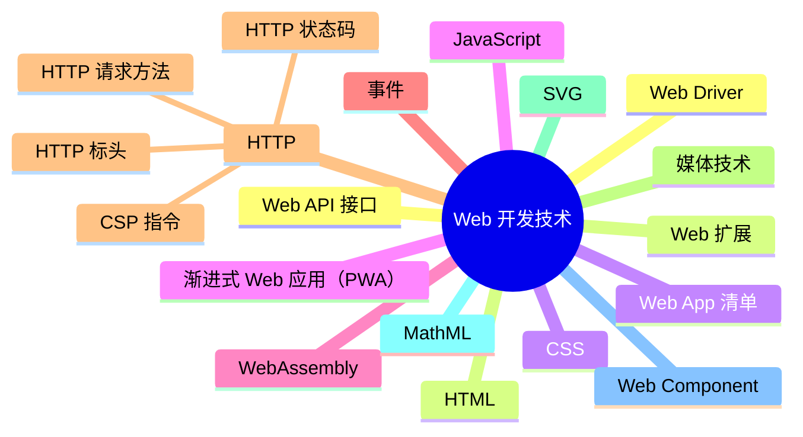

  
> @author： 张丽萍
  @tags: web开发者，html/css, JavaScript, NodeJs, Python, Scratch, 知识搬运工，babyCoding 开创者
  @Personal Declaration: Everything happens for the best 一切都是最好的安排
  
本人修炼千年，只为成精

---
Web(World Wide Web) 全球广域网，又称万维网。是一种图形信息信息。是一种网络服务。
